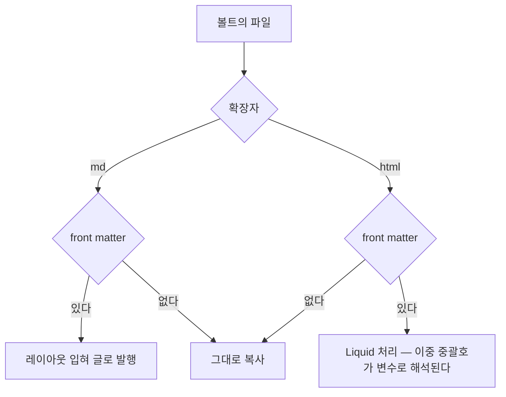

기술 블로그를 안 썼다. 쓸 게 없어서가 아니라 옮기는 일이 귀찮아서였다 — 로컬에 md는 계속 쌓이는데, 블로그에 올리려면 에디터를 하나 더 열고 형식을 다시 맞춰야 했다. GitHub Pages는 그 단계를 요구하지 않았다. md에 front matter 여섯 줄을 붙여 디렉터리를 옮기면 그게 발행이다.

이 글은 그대로 옮겨지는 것과 그대로는 안 되는 것의 경계, 그리고 무료의 대가로 받아들여야 했던 것을 적는다.

{: #what}
## 무엇을 세웠나

로컬에 쌓이는 산출물을 둘 곳이 필요했다. Claude Code로 일하면 내가 만드는 파일이 사실상 두 종류다 — 스펙·플랜·가이드는 md, 시안과 설명 페이지는 self-contained html. 설계 문서를 모아 둔 디렉터리 하나를 세어 보니 md 8 · html 15 · png 11이었다.

| 이 글의 전제 | 실측값 |
|---|---|
| 기간 | 2026-08-30 ~ 09-01, 커밋 27개 |
| 만든 것 | Jekyll 사이트 1개 — 추적 파일 63개(레이아웃·CSS·유출 검사 스크립트 포함) |
| 빌드 | GitHub Pages 기본 빌드. CI workflow 없음 |
| 비용 | 0원 (public repo) |
| 발행한 글 | 0편 |

마지막 줄이 이 글의 한계다. 구조만 세웠고 아직 글을 올리지 않았다. 그러니 이건 "운영해 보니"가 아니라 "세워 보니"다.

{: #friction}
## 안 쓰던 이유는 글쓰기가 아니었다

미뤄 온 이유를 하나씩 적어 보니 전부 옮기는 작업이었다.

| 미룬 이유 | 그게 실제로 요구한 것 | Pages에서는 |
|---|---|---|
| 플랫폼 에디터에 다시 붙여넣어야 한다 | 로컬 md → 웹 에디터 복사 → 형식 다시 맞추기 | md 파일 자체가 글. 복사 단계가 없다 |
| html 산출물을 올릴 데가 없다 | 캡처해서 이미지로 넣거나 다른 서비스에 따로 올림 | front matter 없는 html은 그대로 복사돼 URL 하나를 받는다 |
| 관리 도구가 하나 더 는다 | 계정·에디터·배포를 따로 익힘 | git 하나. 게시 = `mv` → commit → push |
| 나중에 서비스가 바뀌면 | 내보내기·이관 | repo가 원본이다. 생성기를 바꿔도 md는 남는다 |

{: #boundary}
## 그대로 옮겨지는 것과 아닌 것

Jekyll의 판정 기준은 확장자가 아니라 front matter 유무다.



*front matter가 "글이 되느냐 파일로 남느냐"를 가른다 — 통짜 html은 front matter를 안 붙이는 쪽이 안전하다.*

그래서 옮기기 전에 볼트를 세어 봤다. 아래는 로컬 md 볼트 1개를 `find`·`grep`으로 집계한 값이다(2026-09-01, md 457 · html 64).

| 볼트에서 흔한 것 | 개수 | Pages에서 어떻게 되나 | 해야 할 일 |
|---|---|---|---|
| front matter 없는 md | 243 / 457 | 글이 아니라 정적 파일로 복사된다 | 여섯 줄 붙이기 |
| 한글 파일명 | 252 / 457 | 파일명이 곧 URL이라 퍼센트 인코딩된다 | ASCII 슬러그로 새 파일명 |
| 위키링크 `[[문서]]` | 74 / 457 | kramdown이 링크로 안 바꾼다. 대괄호째 출력 | 상대 경로 링크로 |
| 이중 중괄호가 든 html | 3 / 64 | front matter를 붙이는 순간 Liquid 변수로 먹힌다 | front matter 없이 두기 |

네 줄 다 파일 하나씩 손보면 되는 일이고 변환기를 붙일 만한 양은 아니었다. 올릴 글만 골라 옮기니까. 볼트 전체를 미러링할 생각이라면 얘기가 달라진다 — 그건 변환기가 필요하고 변환기가 생기는 순간 "옮기는 단계가 없다"는 이 조합의 유일한 장점이 사라진다.

{: #free-tier}
## 무료의 조건은 public repo다

GitHub Pages는 Free 플랜에서 public repo만 게시한다(2026-08-29 확인). private repo에 Pages를 켜려면 상위 플랜을 요구한다. 글만 공개되는 게 아니라 repo 소스와 커밋 이력이 통째로 공개된다.

| 무료로 얻은 것 | 대신 받아들인 것 |
|---|---|
| 호스팅·빌드·HTTPS 0원 | 초안·설정·커밋 메시지까지 전부 공개 |
| CI 없이 push하면 반영 | 잘못 커밋한 것은 나중에 지워도 이력에 남는다 |
| 서버 관리 없음 | 접근 제어가 없다. 비밀번호 보호는 상위 플랜 |

그래서 초안 디렉터리를 gitignore하고 push 전 검사를 하나 세웠다. 처음엔 최신 트리만 봤는데, 그러면 잘못 커밋한 파일을 다음 커밋에서 지우고 push하는 경우가 통과해 버린다. 원격 이력에는 그 blob이 그대로 남는데도. 범위 전체를 보도록 고쳤다.

```bash
# .githooks/pre-push — 팁 트리가 아니라 push되는 커밋 범위 전체를 검사한다
range="$remote_sha..$local_sha"
"$ROOT/scripts/check-publish.sh" --range $range || status=1
```

{: #again}
## 다시 한다면

로컬 빌드를 맨 먼저 세운다. 날짜가 미래인 글이 목록에서 조용히 빠지는 걸 실제 빌드에서야 알았다. Jekyll은 `future` 기본값이 false라 미래 날짜 글을 뺀다.

`_config.yml`에 `future: true` 한 줄이면 끝나는 문제다. 다만 렌더해 보기 전에는 "올렸는데 목록에 없다"로만 보인다. GitHub이 빌드해 주니 로컬 툴체인 없이도 첫 글은 나가지만 없으면 이런 걸 계속 늦게 발견한다.

| 당신의 상황 | 권한다 / 말린다 |
|---|---|
| 산출물이 md·html이고 글 단위로 골라 올린다 | 권한다. 옮기는 단계가 없다 |
| 볼트 전체를 자동 미러링하고 싶다 | 말린다. 변환기가 필요해지고, 그러면 전용 도구가 낫다 |
| 초안과 커밋 이력까지 비공개여야 한다 | 말린다. Free 플랜은 public repo가 전제다 |
| 댓글·통계·구독 관리가 필요하다 | 말린다. 전부 외부 서비스를 붙여야 한다 |

지금 확인해 볼 것 하나. 볼트에서 첫 줄이 `---`인 md가 몇 개인지 세어 보라. 그 수가 옮길 준비가 이미 끝난 글의 수다.

```bash
find . -name '*.md' -exec sh -c 'head -1 "$1" | grep -q "^---$" && echo "$1"' _ {} \; | wc -l
```
