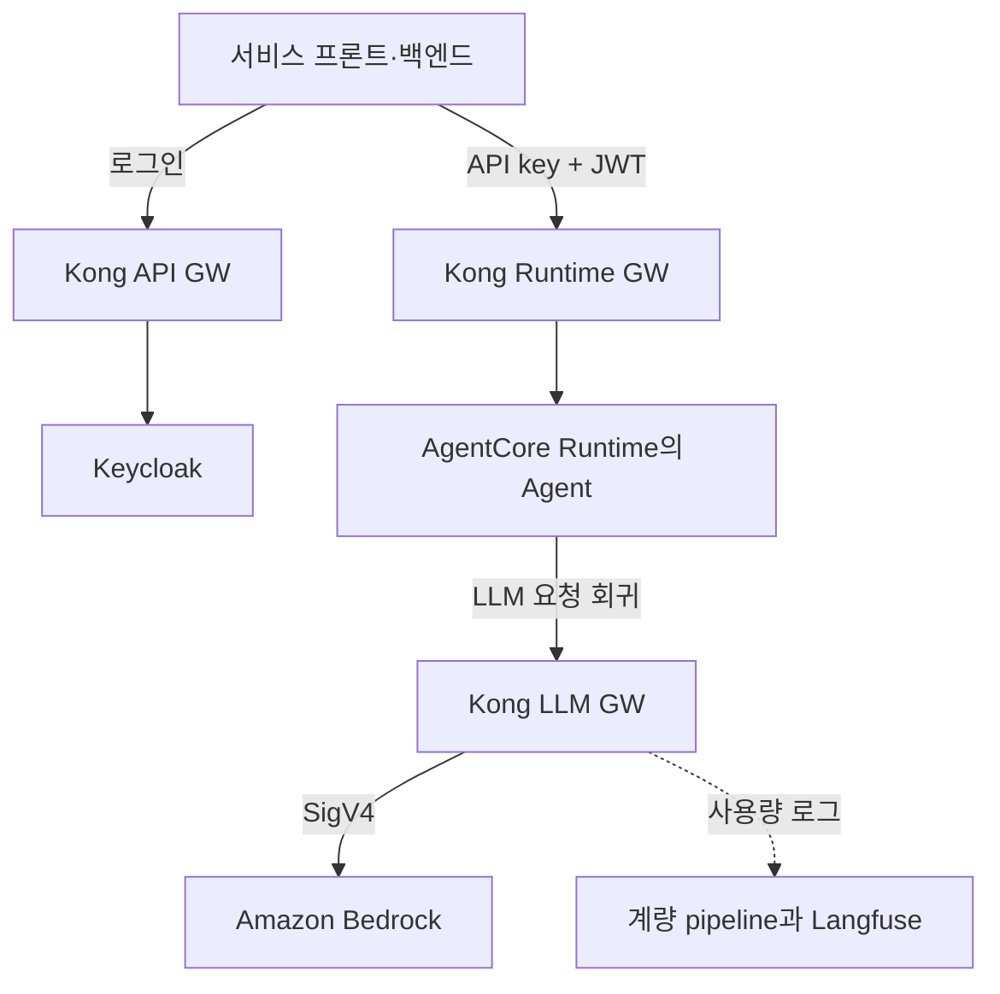

모델 호출 정책을 한 경로에만 걸려고, Agent도 Kong LLM GW를 거쳐 Bedrock을 부르게 했다.
Kong 관문은 서비스 요청, Agent 호출, 모델 호출용 셋으로 나눴다.
AI Agent 플랫폼 Gateway에서 관문을 어떤 기준으로 나눴고 인증·계량을 어디에 뒀는지, 그 이유와 비용까지 다룬다.

Kong으로 AI Gateway를 운영하면서 AgentCore Runtime이나 Bedrock을 붙이려는 사람을 전제로 한다.

{: #overview data-k="OVERVIEW"}
## 관문을 셋으로 나누고 모델 요청은 LLM GW 한 곳으로 모았다

이 글의 조건: dev 환경, Amazon EKS 위 Kong Gateway OSS 3.9.3, Keycloak 26.3, Amazon Bedrock AgentCore Runtime, self-host Langfuse 3.173.

서비스 요청은 API GW를 지나고 Agent 호출과 모델 호출은 각각 Runtime GW와 LLM GW를 지난다.
Agent 실행 role에는 `bedrock:InvokeModel` 권한이 없어서 Agent의 모델 호출도 LLM GW로 되돌아온다.
인증·quota·계량 정책은 이 경로 하나에서 적용한다.



*Agent가 모델을 부를 때도 EKS의 LLM GW로 돌아오므로, 모델 호출 정책을 적용하는 곳은 LLM GW 하나다.*

[전체 다이어그램 보기](/explain/ai-gateway-architecture-diagram.html){:target="_blank" rel="noopener"}

{: #flow data-k="FLOW"}
## 사용자 JWT 하나가 모델 호출까지 5단계를 따라간다

1. **서비스 진입**: 사용자가 ALB로 서비스 프론트에 들어와 API GW를 거쳐 Keycloak 로그인과 백엔드 호출을 한다. 백엔드가 모든 Agent의 앞단이다.
2. **Agent 호출**: 백엔드가 service API key와 사용자 JWT를 함께 들고 Kong Runtime GW를 지난다.
3. **Runtime 실행**: AgentCore Runtime이 인바운드 JWT를 검증한 뒤 Agent를 실행한다.
4. **LLM 요청 회귀**: Agent가 Runtime ID별 API key와 같은 사용자 JWT로 Kong LLM GW를 부른다.
5. **모델 호출**: LLM GW가 IRSA로 받은 IAM role로 SigV4 서명해 Bedrock을 부른다. 응답은 역순으로 돌아간다.

API key는 호출한 서비스나 Agent의 자격을, JWT는 사용자의 신원을 증명한다.
JWT 검증은 구간별로 나눴다. Gateway는 issuer에 맞는 공개키로 서명과 만료를 확인하고 사용자별 rate limit도 건다.
audience·client 같은 claim 조건은 Runtime의 JWT authorizer가 Agent 실행 전에 보므로 Gateway에서는 반복하지 않았다.

<details markdown="1">
<summary>Agent에서 사용자 JWT를 다시 쓰게 설정할 사람이 펼치기: 4단계에 필요한 Runtime 설정</summary>

4단계가 되려면 Runtime 인증에 쓴 JWT가 Agent 코드까지 와야 한다.
AgentCore Runtime의 `requestHeaderConfiguration.requestHeaderAllowlist`에 `Authorization`을 넣었다.

```json
{
  "requestHeaderConfiguration": {
    "requestHeaderAllowlist": ["Authorization"]
  }
}
```

`Authorization`이 allowlist에 없으면 Runtime이 이 헤더를 Agent 코드에 넘기지 않아 LLM GW가 401을 낸다.
Agent는 받은 토큰을 재교환하지 않고 원문 그대로 LLM GW에 싣는다.
Runtime 실행 role에는 ECR pull과 CloudWatch Logs 권한만 둔다. SigV4 서명은 LLM GW가 대신한다.

</details>

{: #components data-k="COMPONENTS"}
## claim 검증은 Runtime에, 계량은 모델 호출 경로 밖에 뒀다

Vector(허용 필드만 재조립)와 Metering Adapter(Langfuse 형식 변환)가 계량을 맡는다.

| 컴포넌트 | 맡은 일 | 이렇게 둔 이유 | 감수한 비용 |
|---|---|---|---|
| Keycloak | 사용자 로그인과 JWT 발급, service client 등록 | 서비스별 인증을 한곳으로 모으고 어느 서비스에서 로그인해도 같은 사용자로 식별 | 모든 서비스의 로그인이 Keycloak 가용성에 묶임 |
| Kong Gateway (API·Runtime·LLM) | JWT 서명·만료 확인, 사용자별 rate limit, Bedrock SigV4 서명, 사용량 로그 기록 | 처리 시간이 긴 LLM·Agent 요청이 일반 API에 영향을 주지 않게 관문을 분리 | 모든 요청이 Gateway를 한 번 더 거치고 Gateway 장애가 전체로 번짐 |
| AgentCore Runtime | 인바운드 JWT의 audience·client 조건 검증과 Agent 실행 격리 | claim 조건을 Runtime의 JWT authorizer 한곳에 모아 Gateway 설정과 겹치지 않게 함 | Agent 실행 환경이 AWS 관리형 서비스에 묶임 |
| 계량 pipeline (Vector·Metering Adapter·Langfuse) | Kong 사용량 로그를 허용 필드만 추려 Langfuse 형식으로 적재 | 계량이 늦어도 모델 응답에는 영향이 없게 LLM 호출 경로와 분리 | 계량 지연·유실이 생기고 별도 대조가 필요 |

근거는 AWS의 [AgentCore Runtime 보안 모범 사례][aws-runtime-security] 문서다(2026-09-14 확인).
이 문서는 JWT authorizer에 audience, client, scope, custom claim 검증 필드를 모두 설정하라고 권한다.
claim 조건을 Runtime에 모은 것은 이 권고를 따른 배치다.

<details markdown="1">
<summary>계량 중복을 어떻게 막는지 볼 사람이 펼치기: 요청 ID로 만든 중복 제거 키와 집계 세 축</summary>

계량 pipeline은 Kong 로그의 요청 ID 하나로 trace·generation과 중복 제거 키를 만든다.
그래서 같은 이벤트를 다시 받아도 새 호출로 세지 않는다.
사용량은 사용자·client·agent 세 축으로 나눠 쌓는다.

</details>

이 구조는 dev 환경에서만 구성했다.

[aws-runtime-security]: https://docs.aws.amazon.com/bedrock-agentcore/latest/devguide/runtime-security-best-practices.html
