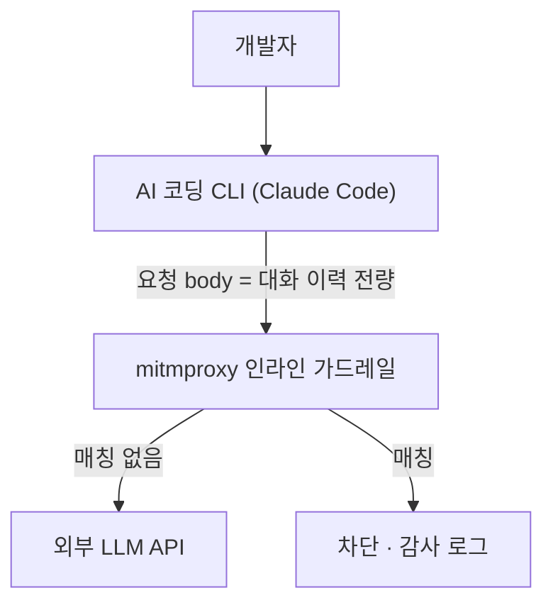

AI 도구의 요청이 회사 밖으로 나가기 전 정책을 검사하는 프록시를 로컬 환경에 뒀다. 테스트로 넣은
`DROP TABLE` 쿼리 한 건에 막힌 세션이 그 뒤로 무엇을 입력하든 계속 막혔다. 이력이 매 요청 통째로
재전송되는 구조라, 한 번 걸린 문자열이 그 세션의 **상태**로 굳은 것이다. 무엇을 검사에서 빼야 하는지 적는다.

{: #situation data-k="SITUATION"}
## 어디서, 무엇을 하다가

개발자가 쓰는 AI 코딩 CLI(Claude Code)의 요청이 외부 LLM API로 나가기 전에 mitmproxy 인라인 가드레일을
거치게 했다. OAuth 토큰은 건드리지 않고 요청 body만 검사한다.

정책은 둘이다 — 민감정보(PII) 탐지·마스킹과, `DROP TABLE` 같은 파괴적 SQL을 막는 제한 정책. 이 건에
걸린 것은 후자다.



*검사 단위는 "방금 친 한 줄"이 아니다. 매 요청 통째로 다시 오는 대화 이력 전체다.*

Messages API는 서버에 대화 상태를 두지 않는다. 이어서 말하려면 이전 turn을 전부 `messages` 배열에 다시
실어 보낸다. 이 계약이 이 사고의 전제다.

요청 안에서 "사람이 친 글자"의 자리는 셋으로 갈린다.

```json
{
  "system": "조직 정책 · 도구 사용 규칙",
  "messages": [
    { "role": "user", "content": "이 로그 좀 봐줘" },
    { "role": "assistant", "content": [{ "type": "tool_use", "name": "read_file", "input": {} }] },
    { "role": "user", "content": [{ "type": "tool_result", "content": "파일 내용 …" }] }
  ]
}
```

`system`은 top-level 파라미터라 눈에 띈다. 반면 도구 실행 결과는 `role: "user"` 메시지 안의 `tool_result`
블록이다 — 역할 이름은 user지만 사람이 친 글자가 아니다.

{: #symptom data-k="SYMPTOM"}
## 보이는 것

발견은 업무 중이 아니라 가드레일 정책을 테스트하던 중이었다. 시나리오에 `DROP TABLE` 쿼리를 넣어 SQL 제한
정책이 막는지 확인했고, 막혔다. 여기까지는 의도한 결과다. 문제는 그다음이었다.

세션 단위로 갈렸다. 멀쩡한 세션은 끝까지 멀쩡했고, 한 번 막힌 세션은 무해한 입력에도 계속 막혔다.

| 관측된 것 | 처음 읽은 뜻 | 실제 뜻 |
|---|---|---|
| 특정 세션의 모든 요청이 차단 | 프록시나 계정이 통째로 죽었다 | 그 세션의 이력이 테스트로 넣은 `DROP TABLE` 을 물고 있다 |
| 클라이언트가 재로그인을 안내 | 인증이 만료됐다 | 클라이언트가 차단 응답을 원인 불문 재로그인으로 표시했다 |
| 재로그인해도 증상 동일 | 인증 문제가 안 풀린다 | 인증과 무관하다 — 이력이 그대로다 |
| 오탐 조사 문서를 읽은 세션이 그 뒤로 실패 | 우연 | 조사 문서 본문의 트리거 문자열이 이력에 적재됐다 |

마지막 행이 제일 기묘했다. **사고를 조사하려고 쓴 문서가 사고를 재생산했다.** 문서를 읽힌 세션은 그
시점부터 못 쓰게 됐다.

{: #root-cause data-k="ROOT CAUSE"}
## 가설 → 확인

| 가설 | 확인 방법 | 판정 |
|---|---|---|
| 인증·토큰이 만료됐다 | 재로그인 후 같은 세션에서 재요청 | 기각 — 증상 동일 |
| 새 입력이 매번 트리거를 건드린다 | 무해한 입력으로 같은 세션에서 재요청 | 기각 — 입력 내용과 무관하게 차단 |
| 1차 오탐 수정으로 이미 끝났다 | 차단된 요청에서 어느 블록이 걸렸는지 확인 | 기각 — `system`만 빠졌고 `tool_result`는 남아 있었다 |
| 그 구간에는 가드레일이 꺼져 있었다 | 가드레일 감사 로그의 타임스탬프와 클라이언트가 받은 오류를 건별 대조 | 기각 — 껐다고 인지한 구간에도 가동 중이었다 |

세 번째 행이 원인이고, 두 번째 행이 그 원인이 왜 영구 차단으로 보이는지를 설명한다. 이력을 매번 통째로
다시 보내니, 한 번 오염된 이력은 새 입력과 무관하게 계속 검사대에 오른다. 오탐 한 건이 요청 한 건의
실패가 아니라 세션 전체의 사망이 된다.

네 번째 행은 곁가지처럼 보이지만 진단 시간을 가장 많이 잡아먹었다. 차단 주체를 확정하려고 감사 로그와
클라이언트 오류를 건별로 맞춰 보고 나서야, "가드레일을 껐다"는 인지와 실제 가동 구간이 어긋나 있었다는
사실이 드러났다. **조치했다는 인지와 실제 반영은 다르다.**

{: #fix data-k="FIX"}
## 바꾼 것

1차 수정은 블록을 하나씩 상대했다. `system`이 걸리길래 `system`을 뺐다. 성격이 같은 `tool_result`는
그대로 뒀다.

| 요청에 실려 가는 것 | 사용자가 친 글자인가 | 1차 수정 | 최종 |
|---|---|---|---|
| top-level `system` | 아니다 | 제외 | 제외 |
| `user` 메시지 안의 `tool_result` 블록 | 아니다 | **남김** | 제외 |
| 사용자가 직접 친 프롬프트 | 그렇다 | 검사 | 검사 |

최종 기준은 블록 이름이 아니라 "사용자 의도인가"다. 이 질문으로 가르면 `system`과 `tool_result`는 같은
편에 선다. `role`로 가르면 갈라진다.

제외 범위를 넓힌 대가는 분명하다. 도구가 읽어 온 파일이나 명령 출력에 실제 민감정보나 파괴적 SQL이 들어
있어도 이제 검사하지 않는다. 요청 경로 가드레일이 잡던 것 하나를 포기하고 세션이 통째로 죽는 쪽을 막았다.

{: #prevention data-k="PREVENTION"}
## 다시 안 겪으려면

| 넣은 것 | 무엇을 막나 | 아직 못 막는 것 |
|---|---|---|
| 오탐 수정의 완료 조건을 "같은 부류를 전부 걷어냈는가"로 정의 | 같은 성격의 블록이 하나 남아 다시 터지는 것 | 부류를 나눈 기준 자체가 틀린 경우 |
| 사용자 의도가 아닌 입력을 부류 단위로 일괄 제외 | 이력 오염이 세션 전체를 죽이는 것 | 도구가 읽어 온 내용에 든 진짜 민감정보·파괴적 SQL |
| 차단 판정을 감사 로그 타임스탬프 × 클라이언트 오류로 건별 대조 | "껐다"는 인지와 실제 가동 구간의 어긋남 | 대조는 여전히 사람이 사후에 한다 |

구조 자체는 그대로다. 이력을 매번 재전송하는 프로토콜 앞에 인라인 검사기를 두는 한, 어떤 오탐이든 요청
한 건이 아니라 세션 단위 장애로 증폭된다. 오탐 확률을 낮출 뿐 증폭 계수는 못 낮췄다.

같은 걸 만들고 있다면 네 가지를 먼저 확인해 보라.

- 검사기가 보는 것이 "이번 입력"인지 "이력 전체"인지. Messages API 앞에 붙였다면 후자다.
- 제외 목록이 `role`이나 필드 이름으로 갈려 있는지, "사용자 의도인가"로 갈려 있는지.
- 차단 응답이 클라이언트에서 무엇으로 보이는지. 재로그인 안내로 보이면 진단이 통째로 어긋난다.
- 가드레일을 껐다고 아는 구간이 감사 로그에서도 비어 있는지.
