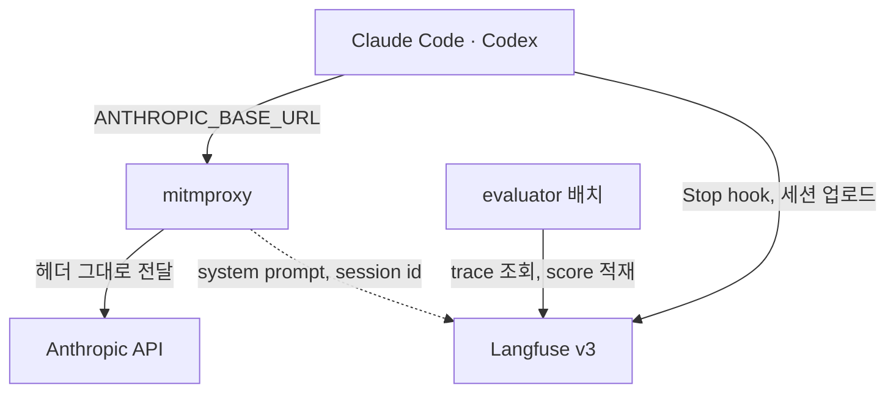
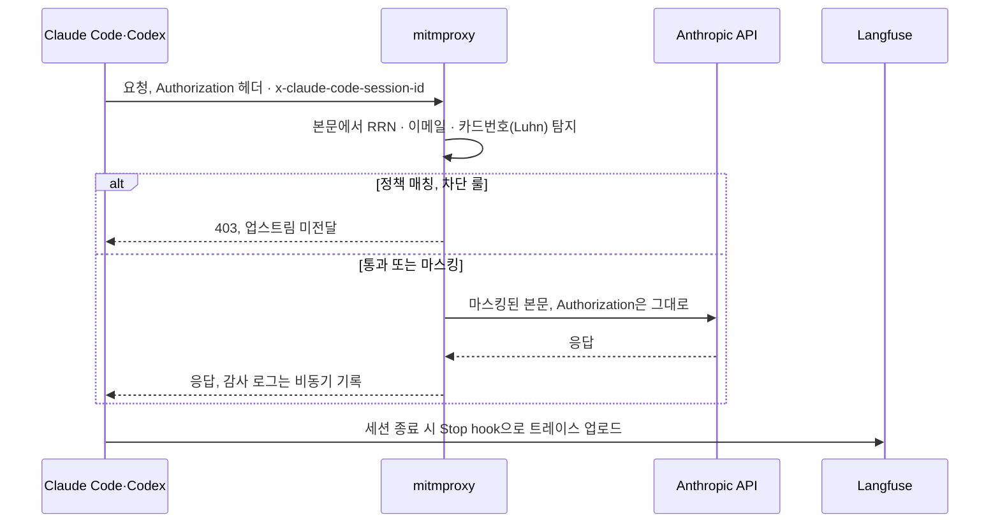

Claude Code·Codex를 로컬에서 매일 쓰면 요청이 밖으로 나가기 전에 걸러줄 지점도, 세션 기록도,
응답 품질을 판단할 근거도 없다. 이 스택은 요청 경로의 가드레일과 끝난 세션의 관측·평가를
서로 다른 컴포넌트로 나눠 붙였다. 가드레일·세션 관측·평가에 관심 있는 사람이 독자다.
mitmproxy·Langfuse·evaluator 세 컴포넌트가 각각 무엇을 맡고 무엇을 감수했는지 이 글에서 확인할 수 있다.

{: #overview data-k="DESIGN"}
## 전체 구조

가드레일은 요청이 나가는 순간에 붙이고, 관측·평가는 세션이 끝난 뒤 붙였다 — 시점으로 책임을 나눴다.

*관측·평가 배치가 느려지거나 멈춰도 요청 경로의 응답 시간에는 영향이 없다.*

[전체 다이어그램 보기](/explain/llmops-architecture-diagram.html)

{: #flow data-k="DESIGN"}
## 요청이 지나가는 경로

*가드레일이 오류를 내도 인증 흐름은 영향을 받지 않는다.*

인증은 프록시가 건드리지 않는다. 프록시가 검사하는 대상은 요청 본문뿐이라, 가드레일이 오류를
내도 인증이 함께 깨지지 않는다. 차단 여부는 정책 엔진이 본문 매칭 하나로 결정한다. 계량(토큰 사용량 집계)은 이 시퀀스와
별도로, 프록시 안 스레드 안전 카운터가 누적한다.

{: #components data-k="DESIGN"}
## 컴포넌트별 역할과 설계 판단

| 컴포넌트 | 맡은 일 | 이렇게 둔 이유 | 감수한 비용 |
|---|---|---|---|
| mitmproxy 가드레일 | 요청 본문에서 주민등록번호·이메일·카드번호(Luhn 검증)를 탐지해 마스킹하거나, 정책에 걸리면 403으로 차단한다 | 프록시가 인증 헤더까지 건드리면 가드레일 장애가 인증 장애로 번진다. 헤더는 원문 그대로 두고 본문만 검사해 두 경로를 분리했다 | 정규식 기반 탐지라 문맥 없는 오탐 가능성이 있다 |
| Langfuse v3(self-hosted) | Claude Code·Codex가 세션 종료 시 Stop hook으로 직접 올리는 트레이스를 저장하고, 프록시가 비동기로 보내는 system prompt를 같은 `x-claude-code-session-id`로 묶는다 | 외부 SaaS 관측 도구를 쓸 수 없는 환경이라 저장·집계까지 직접 구동해야 했다 | 코어만 서비스 7개를 운영해야 하고, 모니터링까지 얹으면 18개로 늘어난다 |
| evaluator 배치(LLM-judge) | `EVAL_TRACE_TAGS`로 태그된 트레이스를 주기로 읽어 helpfulness·relevance·conciseness·hallucination 4축으로 채점하고 `score.create`로 멱등 적재한다 | Langfuse 내장 판정 서버(LLM Connection) 대신 이미 구독 중인 Claude·Codex CLI로 판정을 맡겼다. 판정 CLI는 관측 플러그인이 없는 별도 설정(`~/.claude-evaluator`)이라, 판정 자체가 트레이스를 만들어 무한루프에 빠지지 않는다 | 채점 근거로 트레이스 로그를 프롬프트에 주입해야 해서, 그 로그에 남은 한국어 PII를 자체 정규식으로 한 번 더 가린다 |

세 컴포넌트를 하나로 합친 단일 repo 대안도 있었다. 코드 의존성 0·포트 충돌 0이라 합쳐도
결합이 생기지 않는다는 걸 분리 설계 문서에서 확인했다.
그럴수록 각자 독립 배포·독립 공개가 쉬운 쪽을 택할 이유만 남았다.

{: #limits data-k="DESIGN"}
## 한계와 다음 단계

- 가드레일과 사후 평가는 아직 나 한 명을 위한 통제다. 여러 사람이 함께 쓰는 규모에서는
  다시 검증해야 한다.
- evaluator의 PII 마스킹은 최소 패턴 셋이라 완전한 마스킹을 보장하지 않는다.
