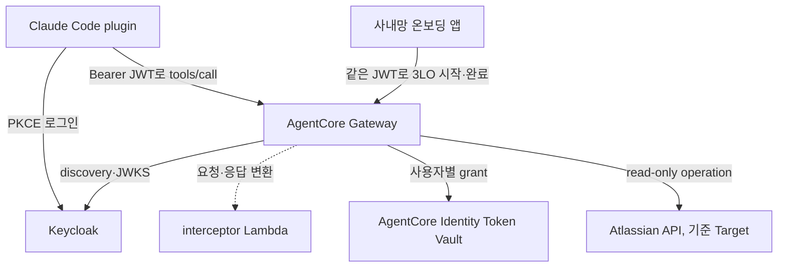
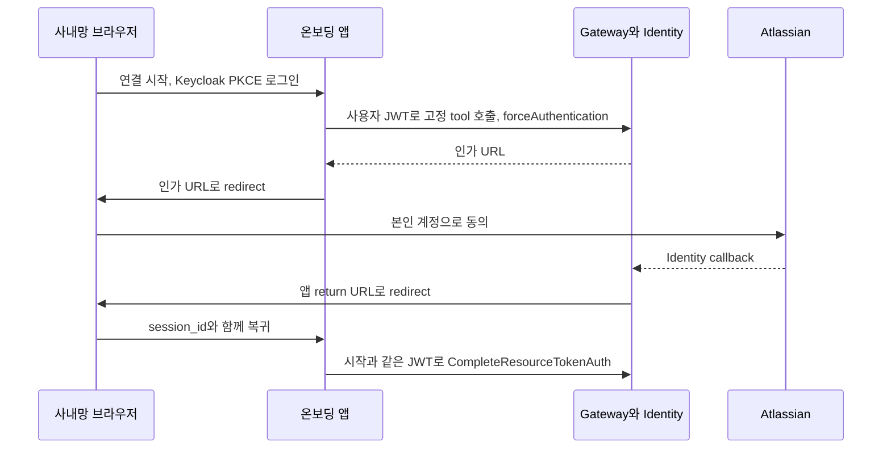

누가 어떤 도구를 부르는지 조직이 정하려고, AI 개발 도구가 AgentCore Gateway만 거치게 했다.
진입은 사내 Keycloak token으로 한다.
Atlassian 같은 대상 시스템 호출은 사용자 본인의 grant로 한다.
통제 지점의 위치, 첫 동의 흐름, Cedar 없이 감수한 비용까지 다룬다.

진입 인증은 사내 Keycloak OIDC다.
Keycloak에는 Microsoft Entra ID(Azure AD)를 IdP로 등록했다.
대상 시스템 호출 인증은 시스템마다 사용자별 3LO, API key, 인증 없음 중 하나다.
인증이 없는 공개 API는 사내 로그인만으로 통과시킨다.
이 글은 Keycloak으로 진입하고, 사용자별 3LO 첫 동의를 클라이언트 밖에서 끝내는 경로를 다룬다.

Keycloak으로 AI Agent 플랫폼을 운영하며 MCP 도구 연결을 붙이려는 사람을 전제로 한다.
모델 호출 경로는 [앞 글](/tech/ai-gateway-architecture/)에서 다뤘다.

{: #overview data-k="OVERVIEW"}
## 도구 호출은 Gateway 한 곳을 지나고 동의만 온보딩 앱이 받는다

Claude Code plugin은 Gateway endpoint 하나만 안다.
Gateway는 Keycloak token을 확인한다.
그다음 그 사용자의 grant로 대상 시스템 API를 대신 부른다.
동의 이력이 없으면 interceptor가 사내망 온보딩 앱 링크를 돌려준다.



*대상 시스템 token은 Token Vault 밖으로 나오지 않아서, plugin과 온보딩 앱 어느 쪽도 token을 다루지 않는다.*

[전체 다이어그램 보기](/explain/mcp-gateway-architecture-diagram.html)

이 글의 구성과 검증은 Atlassian 기준이다.

<details markdown="1">
<summary>Atlassian 외 시스템을 붙일 사람이 펼치기: Google·Slack·사내 API를 Target으로 붙이는 방식과 이번에 구성한 범위</summary>

대상 시스템은 Target 단위로 바꿔 끼운다.
표의 나머지 행은 같은 경계에 붙이는 예시다.

| 대상 시스템 (예시) | 노출할 도구 예 | Target과 outbound 인증 | 이 작업에서 한 것 |
|---|---|---|---|
| Atlassian Jira·Confluence | 이슈 검색, 페이지 조회 | OpenAPI Target, 사용자별 3LO | 이 글의 기준 구성으로 검증 |
| Google YouTube·Workspace | 영상 검색, Drive 파일 조회 | OpenAPI Target, `GoogleOauth2` 사용자별 3LO | YouTube만 별도 Gateway로 구성, Drive·Calendar는 예시 |
| Slack | 채널 메시지 조회 | `SlackOauth2` provider의 사용자별 3LO | 구성하지 않음, Web API가 form-encoded POST라 OpenAPI 매핑 품이 큼 |
| 사내 API·데이터 | 사내 보고서 목록 조회 | Lambda Target, Gateway 실행 role | 별도 Gateway로 구성, 호출 사용자별 attribution 없음 |

YouTube Gateway는 같은 진입 gate와 interceptor 코드, 온보딩 앱 코드를 재사용했다.
Slack 행은 구성 전 연결 대상 조사 기록의 판단이다.

</details>

{: #flow data-k="FLOW"}
## tool 호출 한 번이 통제 지점 넷을 차례로 지난다

1. **진입**: authorizer가 `aud`·`scope`·`groups` 세 조건을 모두 본다. 이 묶음을 이 글에서는 진입 gate라 부른다.
2. **연결**: Gateway가 token의 `iss`+`sub`에 묶인 Token Vault grant를 찾는다. 없으면 동의 흐름으로 넘어간다.
3. **제한**: Target 명세에 넣은 operation만 tool로 존재한다(Atlassian 예시는 4개). 그다음은 대상 시스템이 사용자 권한으로 판정한다.
4. **기록**: interceptor 로그에는 `method`·`id`·판정·status만 남기고 본문과 URL은 남기지 않는다.

Gateway 쪽은 CloudWatch 로그와 trace를 켜서 호출을 봤다.
확인 뒤 다시 꺼서 gateway stack의 최종 `*.tf`에는 이 설정이 없다.
호출 사용자와 tool 이름이 로그의 어느 필드에 남는지는 확인하지 못했다.

<details markdown="1">
<summary>authorizer와 plugin을 같은 조건으로 설정할 사람이 펼치기: 설정 값과 client 방식을 고른 근거</summary>

진입 gate는 `aud`에 `agentcore-gateway`, `scope`에 `mcp.tools`, `groups`에 `agent-users`를 요구한다.
`agent-users`가 없는 사용자와 `openid`만 요청한 token은 둘 다 403이었다(검증 script).

`allowedAudience`·`allowedScopes`는 값 하나만 맞아도 통과한다(AWS API reference).
`customClaims`는 조건을 모두 만족해야 한다(같은 문서).
그래서 세 필드를 다 채워 AND로 묶었다.

gateway stack의 authorizer 변수다.

```hcl
authorizer_type  = "CUSTOM_JWT"
discovery_url    = "https://keycloak.example.com/realms/example/.well-known/openid-configuration"
allowed_audience = ["agentcore-gateway"]
allowed_scopes   = ["mcp.tools"] # openid를 넣으면 openid만 가진 token도 통과한다
allowed_clients  = []            # module이 null로 바꿔 필드를 생략한다
custom_claims = [{
  name  = "groups"
  type  = "STRING_ARRAY"
  op    = "CONTAINS"
  value = "agent-users"
}]
```

plugin의 `.mcp.json`이다. endpoint와 공개 client 설정만 담고 secret은 없다.

```json
{
  "mcpServers": {
    "atlassian": {
      "type": "http",
      "url": "https://gateway.example.com/mcp",
      "oauth": {
        "clientId": "claude-code-mcp-gateway",
        "callbackPort": 43123,
        "scopes": "openid mcp.tools"
      }
    }
  }
}
```

- 세 claim은 모두 client scope `mcp.tools`의 mapper가 싣는다. 이 scope를 요청하지 않은 token에는 `aud`·`groups`가 없어 403이다.
- `allowedClients`는 `client_id` claim만 비교한다. Keycloak token에는 `azp`만 있어서, 채우면 정상 token이 거절됐다(실측).
- `groups` mapper의 full path가 켜져 있으면 값이 `/agent-users`가 된다. `customClaims` 값 pattern `[A-Za-z0-9_.-]+`에 걸린다.
- Claude Code는 `scopes`에 `offline_access`를 덧붙여 요청했다. plugin client에 optional scope `offline_access`를 뒀다. 사용자 group에는 realm role `offline_access`를 붙였다. 없으면 `Offline tokens not allowed for the user or client`로 거절된다.
- Claude Code 기본 경로인 DCR 대신 사전 등록한 public client와 PKCE `S256`, loopback redirect 하나를 쓴다.

</details>

{: #consent data-k="CONSENT"}
## 첫 동의는 온보딩 앱이 시작 JWT 그대로 완료한다

Claude Code 2.1.236은 url mode elicitation을 선언하지 않아 첫 호출이 거절됐다.
interceptor는 요청에 url mode capability를 넣는다. 인가 응답은 온보딩 주소가 든 성공 text로 바꾼다.
capability 문제를 좁힌 과정은 [동의 화면 글](/tech/mcp-gateway-consent-capability/)에 있다.



*완료 호출에 시작 JWT를 다시 쓰므로, 앱은 그 JWT를 연결 세션이 끝날 때까지 메모리에 둔다.*

처음 설계는 return 시점에 새 Keycloak JWT를 받아 완료했다.
실측에서 이 방식은 시작 후 31초 안에도 `Invalid or expired session`으로 실패했다.
AWS API 문서는 완료 호출에 시작 때 쓴 사용자 token을 요구한다.
그래서 시작 JWT를 앱 세션에 보관하는 방식으로 바꿨다.
JWT 값 차이가 유일한 실패 원인인지는 확정하지 않았다.

<details markdown="1">
<summary>온보딩 앱을 구현할 사람이 펼치기: interceptor 분기, 시작 요청의 고정 인자, 세션 보관 규칙</summary>

- 거절 오류는 `Missing required client capability`였다. interceptor 요청 단계는 `tools/call.params._meta`에 capability를 넣는다.
- 응답 단계는 `input_required`와 legacy `-32042`를 바꾼다. `returnUrl`을 실은 온보딩 앱과 진단 script의 요청은 원래 응답을 받는다.
- 시작 요청은 Jira `searchJiraIssues` 하나로 고정했다. JQL은 `created < '1970-01-01'`, `maxResults`는 1이다. 사용자는 tool·argument·host를 고르지 않는다.
- `_meta`에는 `returnUrl`과 `forceAuthentication=true`를 싣는다. 그래서 revoke 뒤에도 같은 페이지에서 새 동의를 시작할 수 있다.
- state·PKCE verifier·시작 JWT·authorization session은 메모리에만 둔다. 브라우저에는 Secure·HttpOnly·SameSite=Lax cookie(600초)만 준다.
- 세션 유효기간은 600초와 JWT `exp` 중 빠른 쪽이다. 최대 1,024개를 받고 Uvicorn worker는 1개다.
- 완료는 cookie 세션과 return의 `session_id`가 모두 맞을 때만 한다. return URL을 다른 브라우저에 복사해도 완료되지 않는다.
- EC2 instance role에는 `CompleteResourceTokenAuth`와 provider Secret 하나의 `secretsmanager:GetSecretValue`가 필요했다. 후자는 CloudTrail의 `AccessDenied`로 확인했다.

</details>

{: #components data-k="COMPONENTS"}
## 노출 범위는 Target 명세가, 사용자별 권한은 대상 시스템이 정한다

Cedar는 연결하지 않았다. 권한 상한은 진입 gate, Target 명세, 사용자의 대상 시스템 권한 세 겹이다.

| 컴포넌트 | 맡은 일 | 이렇게 둔 이유 | 감수한 비용 |
|---|---|---|---|
| Keycloak 26.2 (EC2 Compose) | 로그인과 진입 gate용 claim 발급 | client scope `mcp.tools`를 요청한 client만 세 claim을 받게 함 | EC2가 멈추면 JWKS도 내려가 전 사용자 인증 실패 |
| AgentCore Gateway authorizer (MCP `2026-07-28`) | 진입 gate 세 조건을 AND로 검사 | 조직 경계를 VPC·TLS 작업 없는 managed endpoint 한 곳에 둠 | client 식별은 Keycloak scope 부여에 의존 |
| OpenAPI Target (예시: Jira·Confluence) | 검토한 read-only operation 4개만 tool로 노출하고 cloudId 고정 | MCP 서버 운영 없이 노출 범위를 명세 파일로 고름 | Atlassian 공식 MCP 서버(Rovo)의 검색·ranking이 없고 site는 하나만 허용 |
| AgentCore Identity Token Vault | 사용자별 3LO grant를 `iss`+`sub`에 묶어 보관 | Atlassian 감사 기록에 실제 사용자가 남고 그 사용자 권한이 상한 | 사용자마다 동의가 필요하고 revoke 뒤 복구 경로를 따로 둠 |
| interceptor Lambda | url mode capability 주입과 인가 응답의 안내 변환 | 클라이언트를 바꾸지 않고 동의 경로를 엶 | 클라이언트가 보내지 않은 capability를 대신 선언 |
| 온보딩 앱 | 같은 JWT로 3LO 시작과 완료 | 사용자에게 AWS credential이나 script를 주지 않음 | 단일 worker 메모리 세션이라 재시작하면 연결을 다시 시작 |

클라이언트 동작은 Claude Code 2.1.236·2.1.263 기준이다.
IaC는 Terraform `hashicorp/aws` 6.62 이상으로 썼다.

Target 방식은 공식 Atlassian MCP 서버를 먼저 붙였다가 바꿨다.

<details markdown="1">
<summary>Atlassian 연결 방식을 고를 사람이 펼치기: 기각한 방식 다섯과 사용자별 grant를 고른 근거</summary>

Atlassian REST는 bearer token 사용자의 권한을 상한으로 적용한다.
service account token을 쓰면 감사 actor가 service account로 남는다.
근거는 연동 방식 조사다.

| 대안 | 기각 이유 | 근거 종류 |
|---|---|---|
| Rovo MCP 서버를 MCP Target으로 연결 | 동의 뒤 tool discovery가 `Method not found`로 `FAILED` | 해봤다 |
| 정적 `mcpToolSchema`로 discovery 우회 | `READY`는 됐지만 Atlassian이 전체 schema를 공개하지 않아 catalog로 유지할 수 없음 | 해봤다 |
| MCP Target의 `DYNAMIC` listing | AWS가 outbound 3LO와 호환되지 않는다고 명시 | 문서 확인 |
| Gateway Lambda Target에서 REST 호출 | 기본 Lambda 계약에 호출 사용자 신원이 없어 별도 token broker가 필요 | 문서 확인 |
| AgentCore Runtime의 MCP proxy | OAuth adapter와 token store를 직접 운영 | 추론 |

OpenAPI Target 두 개는 `READY`가 됐다.
plugin 경로에서 Jira read tool 두 개가 성공했다.

</details>

{: #limits data-k="LIMITS"}
## Cedar 없이 둔 경계는 read-only와 test site 하나에서만 성립한다

- 진입한 사용자는 모두 같은 tool 목록을 본다. write tool이나 부서별 제한이 필요해지면 Cedar를 다시 넣는다.
- JQL 안의 넓은 검색과 prompt injection은 막지 않는다. 데이터를 바꾸는 tool에는 사람 승인이 필요하다.
- 사용자 간 grant 격리는 live로 확인하지 못했다. Atlassian 예시에서 두 번째 계정은 app Distribution `Not sharing`에 막혔다(QA).
- revoke 직후 호출은 `An internal error occurred`를 받았다. 약 31분 뒤에는 연결 안내로 바뀌었다(QA).
- claude.ai 웹은 사내망 전용 token endpoint에 막혀 연결되지 않는다(실측). 지금은 CLI 전용이다.

Gateway 경유가 tool 호출에 더하는 지연은 재지 않았다.
다음 판단 기준은 API·LLM·Runtime 관문을 이 Gateway의 Target으로 올려 인증과 사용량 제한을 한 경계로 모을지다.
