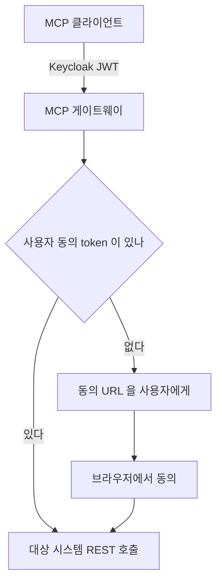
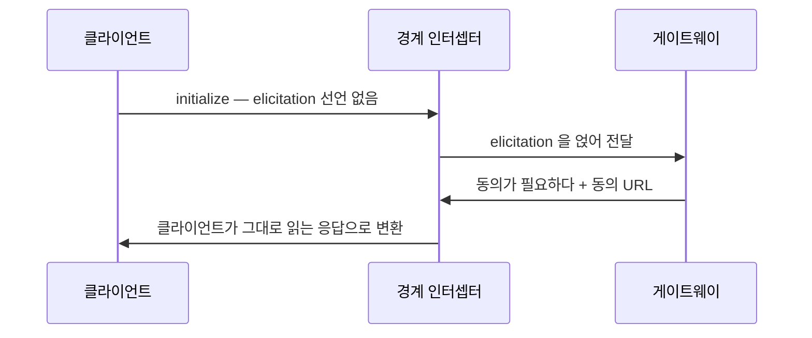

사내 인증 경계 뒤에 MCP 게이트웨이를 두자, 사내 로그인은 되는데 동의가 없는 사용자의 첫 tool 호출이 거절됐다.
게이트웨이가 동의 URL 을 되돌려 줄 통로인 `elicitation` 을 클라이언트가 선언하지 않은 탓이었다.
우리 설정으로 못 푸는 문제를 어디까지 밀고 갈지, 그 순서를 적는다.

{: #situation data-k="SITUATION"}
## 어디서, 무엇을 하다가

AI 개발 도구(Claude Code 등)가 외부 MCP 서버에 직접 붙지 않고 사내 게이트웨이를 거치게 하는 작업이었다.
게이트웨이는 Amazon Bedrock AgentCore Gateway 다.

인증은 두 겹이다.

- **진입** — 사내 Keycloak 계정으로 로그인한다(OAuth 2.0 PKCE). token 의 대상·scope·그룹이 다 맞아야 통과한다.
- **대상 시스템 접근** — 사용자마다 본인 계정으로 동의(3LO)하고, 그 token 은 AgentCore Identity 가 보관한다.
  게이트웨이가 요청마다 그 token 으로 대신 호출한다.



*두 겹 중 3LO 동의만 사용자의 브라우저를 필요로 한다 — 게이트웨이가 혼자 끝낼 수 없는 유일한 단계다.*

{: #symptom data-k="SYMPTOM"}
## 보이는 것

간헐적이지 않았다. 동의 이력이 없는 사용자는 확인한 시도에서 모두 첫 호출의 같은 자리에서 멈췄다.

| 단계 | 결과 | 사용자에게 보인 것 |
|---|---|---|
| Keycloak 로그인 | 성공 | 브라우저 로그인 화면이 뜨고 정상 종료 |
| 동의 이력 없는 사용자의 첫 tool 호출 | 거절 | 클라이언트 능력 부족 오류. 브라우저는 뜨지 않음 |
| 동의를 이미 마친 사용자의 같은 호출 | 성공 | — |

세 번째 행이 범위를 갈랐다. 깨진 것은 tool 호출 경로가 아니라 동의를 처음 받는 경로다.

문제의 자리는 클라이언트가 맨 처음 보내는 `initialize` 안에 있다. 관련된 키만 옮긴다.

```json
{
  "method": "initialize",
  "params": {
    "protocolVersion": "2025-06-18",
    "capabilities": { "roots": { "listChanged": true } }
  }
}
```

`capabilities` 에 `elicitation` 이 없다.

{: #root-cause data-k="ROOT CAUSE"}
## 누가 고칠 수 있나

MCP 규격 2025-06-18 개정은 서버가 사용자에게 무언가를 물을 통로로 `elicitation` 을 정의한다.
그리고 이를 지원하는 클라이언트는 `initialize` 의 `capabilities` 에 `"elicitation": {}` 를 선언해야 한다(MUST)고 못 박는다.

선언이 없으면 서버는 그 통로를 쓸 수 없다. 게이트웨이는 규격대로 거절했다. 고장 난 게 아니다.

| 고칠 수 있는 자리 | 우리가 고칠 수 있나 | 왜 | 남는 경로 |
|---|---|---|---|
| 클라이언트 | 못 한다 | 우리가 만든 제품이 아니다 | 벤더가 능력을 붙일 때까지 대기 |
| MCP 규격 | 못 한다 | MUST 조항이라 우회가 곧 규격 위반 | 개정 제안. 시간 단위가 다르다 |
| 게이트웨이 설정 | 못 한다 | managed 서비스의 3LO 흐름은 설정 항목이 아니다 | 없음 |
| 게이트웨이 경계 | 한다 | 요청·응답 시점에 실행 지점(Lambda)을 끼울 수 있다 | 여기 |

"우리 설정으로 풀 수 있는 문제가 아니다"는 진단의 끝이 아니라 시작이었다.
네 자리를 다 적고 나서야 남는 칸이 하나뿐인 게 보였다.

{: #fix data-k="FIX"}
## 바꾼 것

경계에 인터셉터를 두고 두 시점에 각각 손을 댔다.



*대리 선언과 응답 변환은 한 쌍이다 — 앞만 넣으면 클라이언트는 다룰 줄 모르는 요청을 받는다.*

- **요청 시점** — 인터셉터가 `initialize` 에 `elicitation` 선언을 얹어 게이트웨이의 규격 검사를 통과시킨다.
- **응답 시점** — 게이트웨이가 돌려준 동의 요청을 평범한 응답으로 바꾼다. 사용자는 터미널에서 URL 을 본다.
- **동의 완료** — 사내망 콜백 앱이 redirect 를 받아 마무리한다. 클라이언트는 이 왕복에 참여하지 않는다.

감수한 것이 있다. 인터셉터는 클라이언트가 선언하지 않은 능력을 대신 선언한다.
규격 위에서 보면 거짓 선언이고, 응답 변환이 그 거짓을 끝까지 메워야만 성립한다.

여기까지가 설계다. 운영에서의 동의 성공률과 인터셉터가 더하는 지연은 재지 않았다. 이 글의 범위 밖이다.

{: #prevention data-k="PREVENTION"}
## 다시 안 겪으려면

| 넣은 것 | 무엇을 막나 | 아직 못 막는 것 |
|---|---|---|
| 경계 인터셉터의 능력 대리 선언 | 동의 없는 첫 호출이 오류로만 끝나는 것 | 클라이언트가 나중에 `elicitation` 을 직접 선언하면 대리 선언이 겹친다 |
| 사내망 콜백 앱 | 클라이언트가 redirect 를 못 받는 상황 | 사내망에서만 열리는 콜백이라 그 밖에서 붙는 경로는 따로 봐야 한다 |
| 동의 URL 을 평문으로 노출 | 사용자가 다음에 뭘 할지 모르는 상태 | URL 이 사람 손을 타는 만큼 만료·재사용 관리는 대상 시스템에 맡긴다 |

같은 증상을 만나면 클라이언트가 보낸 `initialize` 의 `capabilities` 부터 본다.
`elicitation` 이 없으면 게이트웨이 로그를 더 뒤질 이유가 없다.

기준 하나가 남았다. 클라이언트도 프로토콜도 고칠 수 없으면 경계에 중계 지점을 둘 수 있는지 먼저 본다.
그 자리마저 없으면 그때 기능을 포기한다.
