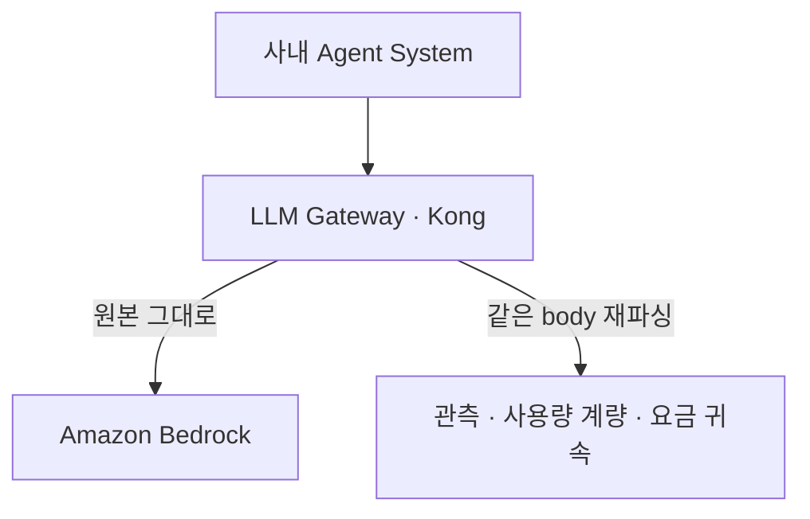

Kong 앞단을 거쳐 Bedrock을 부르는데 `cachePoint`와 `toolResult`가 한 요청에 같이 들어갈 때만 500이 났다.
게이트웨이는 passthrough였지만 계량용으로 같은 body를 한 번 더 파싱했다.
passthrough를 무변환으로 읽지 않는 진단 순서를 적는다.

{: #situation data-k="SITUATION"}
## 어디서, 무엇을 하다가

AI 호출 경로를 사내 게이트웨이 한 곳으로 모으는 중이었다.
사내 Agent System은 Bedrock을 직접 부르지 않는다.



*업스트림에 가는 것은 원본이다 — 그래서 passthrough 설정만 보면 게이트웨이는 무죄로 읽힌다.*

게이트웨이 route는 passthrough로 잡혀 있었다.
그 위에 prompt 캐시를 얹으려고 `cachePoint`를 요청에 넣기 시작한 날 500이 보였다.

{: #symptom data-k="SYMPTOM"}
## 보이는 것

대부분의 호출은 정상이었다. 두 블록이 한 요청에 겹칠 때만 실패했다.

깨진 요청의 모양은 Bedrock Converse API 스펙 그대로다. 값 자리는 비워 둔다.

```json
{
  "messages": [
    {
      "role": "user",
      "content": [
        { "toolResult": { "toolUseId": "...", "content": [ { "text": "..." } ] } },
        { "cachePoint": { "type": "default" } }
      ]
    }
  ]
}
```

| cachePoint | toolResult | 어디로 보냈나 | 무엇이 돌아왔나 |
|---|---|---|---|
| 있음 | 없음 | 게이트웨이 경유 | 200 |
| 없음 | 있음 | 게이트웨이 경유 | 200 |
| 있음 | 있음 | 게이트웨이 경유 | 500 |
| 있음 | 있음 | 게이트웨이 우회 · Bedrock 직접 | 200, 프롬프트 캐시도 적중 |

마지막 줄이 판정을 갈랐다. 같은 payload인데 경로 하나만 다르고 결과가 갈렸다.

{: #root-cause data-k="ROOT CAUSE"}
## 가설 → 확인

| 가설 | 확인 방법 | 판정 |
|---|---|---|
| payload가 스펙 위반이다 | 같은 payload를 Bedrock에 직접 호출 | 기각 — 200에 캐시 적중까지 정상 |
| 모델이나 리전 쪽 일시 장애다 | 블록 조합을 갈라 반복 호출 | 기각 — 겹칠 때만 재현, 하나만이면 안 남 |
| 게이트웨이는 passthrough라 무관하다 | 경유와 우회의 차이가 게이트웨이뿐임을 확인 | 기각 — 이 전제가 오판이었다 |
| 게이트웨이 안에 body를 다시 읽는 경로가 있다 | 배포된 컨테이너 이미지에서 어댑터 소스를 꺼내 읽음 | 확인 — 분석용 변환 경로가 겹친 구조를 못 다뤘다 |

네 번째 줄까지 가는 데 시간이 걸린 이유는 세 번째 줄이다.
설정이 passthrough면 게이트웨이가 body를 안 건드린다고 읽었다.

passthrough여도 게이트웨이는 사용자·client·agent 축으로 사용량을 계량한다.
계량하려면 body를 읽어야 하고, 읽으려면 파싱과 정규화가 붙는다.

업스트림으로는 원본이 그대로 나간다. 깨진 것은 갈라져 나간 분석용 경로였다.

{: #detour data-k="DETOUR"}
## 진단이 한 번 틀어진 곳

원인을 좁히는 중간에 잠정 결론 하나를 틀리게 냈다.

- 500 응답의 에러 라인이 손에 있던 어댑터 소스와 맞지 않았다.
- "에러 인용이 코드와 안 맞는다"고 적어 두고 다른 가설로 넘어갔다.
- 이름이 같은 파일이 두 개였다. 로컬에서 연 쪽은 실행 중인 코드가 아니었다.
- 실행 이미지에서 소스를 꺼내 대조하고서야 정정했다.

에러 인용을 의심하기 전에 대조 대상을 의심했어야 했다.

{: #fix data-k="FIX"}
## 어디까지 갔고 어디서 멈췄나

확정한 것.

- 재현 조건은 응답 크기나 부하가 아니라 `cachePoint`와 `toolResult`의 동시 투입이다.
- 책임 경계는 게이트웨이 내부다. 우회 호출이 같은 payload로 200을 냈다.
- 고장 지점은 업스트림 전달 경로가 아니라 계량·관측용 재파싱 경로다.

확정하지 못한 것.

- 그 변환 경로의 어느 처리가 겹친 구조에서 넘어졌는지는 소스를 읽은 수준까지다. 수리는 내 손으로 넣지 않았다.
- 500 응답 본문과 에러 라인, 발생 비율은 기록으로 남기지 않았다. 그래서 이 글에 인용하지 않는다.

{: #prevention data-k="PREVENTION"}
## 다시 안 겪으려면

| 바꾼 진단 기본값 | 무엇을 막나 | 아직 못 막는 것 |
|---|---|---|
| passthrough를 무변환으로 읽지 않는다. 계량·관측 경로를 용의선상에 남긴다 | 설정만 보고 게이트웨이를 초반에 빼는 오판 | 그 경로가 어떤 입력에서 깨지는지는 여전히 소스를 봐야 안다 |
| 책임 경계는 우회 호출 한 번으로 먼저 가른다 | 요청 형식과 인증부터 되짚는 긴 우회 | 우회 호출을 만들 수 없는 폐쇄 경로 |
| 에러 라인이 코드와 안 맞으면 실행 이미지의 코드부터 꺼낸다 | 동명 파일이나 미배포 소스를 놓고 하는 오진 | 이미지를 열 권한이 없는 환경 |

같은 증상을 만나면 순서는 하나다. 게이트웨이를 빼고 같은 payload를 그대로 한 번 보내 본다.

거기서 200이 나오면 남은 용의자는 passthrough 설정이 아니다.
게이트웨이 안에서 body를 다시 읽는 코드가 남는다.
