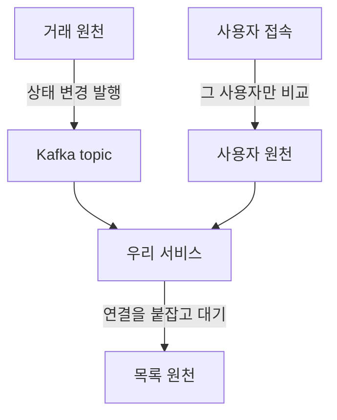
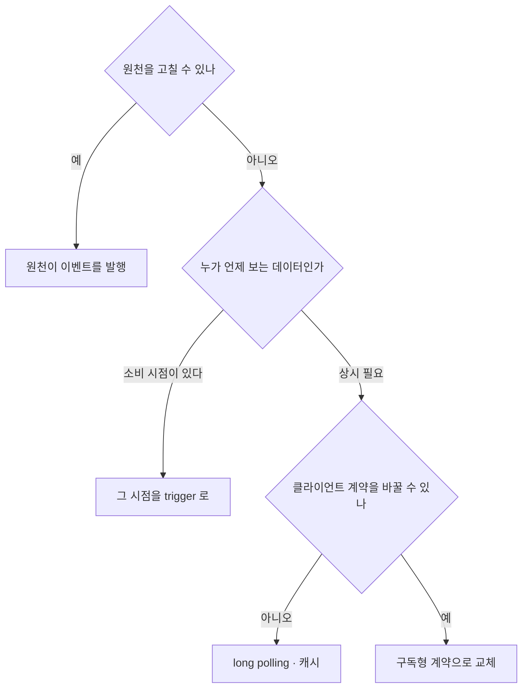

서비스가 쓰는 사용자 정보·거래 상태·목록 데이터를 원천 세 곳에서 받아 왔다.
셋 다 변경 시점을 알려주지 않아 전체를 주기적으로 조회했고, 규모가 커지자 그 비용이 감당되지 않았다.
원천을 바꿀 수 있느냐로 갈라 셋을 각각 다르게 풀었다. 그 갈림 기준을 적는다.

{: #problem data-k="DESIGN"}
## 풀려던 문제와 제약

폴링은 게을러서 남은 구조가 아니었다. 제약 넷이 폴링 말고는 답이 없어 보이게 만들고 있었다.

| 제약 | 어디서 왔나 | 설계에 준 영향 |
|---|---|---|
| 원천이 변경 시점을 알리지 않는다 | 세 원천 모두 조회용 REST 만 제공 | 소비하는 쪽이 스스로 변경을 찾아야 했다 |
| 셋 중 거래 원천만 우리가 고칠 수 있다 | 조직 경계 — 사용자·목록 원천은 다른 조직 소유 | 이벤트 발행을 셋에 다 요구할 수 없었다 |
| 목록 조회 API 를 클라이언트가 이미 쓰고 있다 | 배포된 클라이언트와의 REST 계약 | 요청·응답 형태를 바꾸는 안은 제외 |
| 조회량이 대상 수에 비례해 늘었다 | 전수 × 주기라는 폴링의 형태 | 주기를 만지는 것으로는 증가 추세를 못 꺾는다 |

비용은 당시 청구·모니터링 기록을 남겨 두지 않아 정성으로만 적는다. 이 글에 폴링 주기와 조회 건수는 없다.

{: #alternatives data-k="DESIGN"}
## 기각한 대안

| 대안 | 기각 이유 | 근거 종류 |
|---|---|---|
| 폴링 주기를 늘린다 | 조회량은 줄지만 지연이 그만큼 커진다. 대상 수 증가는 그대로다 | 구조 |
| 폴링 주기를 줄여 실시간성을 맞춘다 | 비용이 반대 방향으로 늘어난다 | 구조 |
| 원천 셋 모두 이벤트를 발행하게 한다 | 사용자·목록 원천은 다른 조직 소유라 우리가 일정을 잡을 수 없다 | 통제권 |
| 한 가지 방식을 셋에 일괄 적용한다 | 제약이 서로 달라, 가장 손이 안 닿는 원천에 나머지를 맞추게 된다 | 통제권 |

측정으로 기각한 항목은 하나도 없다. 셋을 나란히 돌려 비교한 기록이 없어서다.
기각의 근거는 전부 구조와 통제권이었다.

{: #decision data-k="DESIGN"}
## 택한 구조

바꾼 것은 폴링의 주기가 아니라 **trigger 를 어디에 두느냐**였다.

| 원천 | 원천을 바꿀 수 있나 | trigger 를 어디에 뒀나 | 감수한 것 |
|---|---|---|---|
| 거래 상태 | 예 | 원천이 상태 변경을 Kafka topic 으로 발행 | 원천 배포 일정에 묶인다. 유실·순서를 소비 쪽이 떠안는다 |
| 사용자 정보 | 아니오 | 사용자가 서비스에 접속한 시점에 양쪽을 비교 | 접속하지 않는 사용자의 변경은 반영되지 않는다 |
| 목록 데이터 | 아니오 | 서버가 요청을 붙잡았다가 변경이 생기면 응답(long polling) + 캐시 | 대기 연결이 요청 수만큼 살아 있다 |



*셋 다 trigger 가 다른 자리에 있다 — 원천 안, 사용자의 행동, 우리 쪽의 대기 연결.*

사용자 정보는 폴링 배치가 하던 비교를 요청 경로로 옮긴 것이다. 전수 × 주기가 필요한 대상 × 필요한 시점이 됐다.

```text
# 의사코드 — 사용자 정보를 맞추는 시점
on 서비스_접속(사용자id):
    로컬 = 로컬_사용자_조회(사용자id)
    원천 = 원천_사용자_조회(사용자id)      # 전체가 아니라 한 명분
    if 원천.변경시각 > 로컬.변경시각:
        로컬_갱신(원천)
    return 로컬
```

접속마다 원천을 한 번 더 부르므로, 원천 호출은 이제 사용자 수가 아니라 접속 수를 따라간다.
이 교환이 이득인지는 접속 수와 사용자 수의 비가 정한다.

{: #limits data-k="DESIGN"}
## 이 구조가 틀리는 조건

- **소비 시점이 없는 데이터** — 사용자가 보지 않아도 집계·배치가 최신값을 요구하면 접속 시점 trigger 는 못 쓴다.
- **소비 쪽이 유실·중복을 못 견딜 때** — 이벤트 발행만으로는 정합성이 따라오지 않는다. 재조회 경로를 남겨야 한다.
- **대기 연결이 서버 동시 연결 한계에 닿을 때** — long polling 의 유휴 연결도 자원을 잡는다.
- **변경이 원천 전체에서 고르게 자주 일어날 때** — 그때는 전수 폴링이 오히려 단순하고 싸다.
- **사용자 수보다 접속 수가 훨씬 많을 때** — 접속 시점 비교가 전수 조회보다 비싸질 수 있다.

{: #checklist data-k="DESIGN"}
## 다음에 같은 연동을 만나면



*이 판정은 데이터의 성격이 아니라 통제권으로 갈린다 — 무엇을 고칠 수 있는지가 먼저다.*

연동 목록을 열어 항목마다 세 질문을 던지면 된다. 원천을 고칠 수 있나, 이 데이터를 누가 언제 보나,
클라이언트 계약을 바꿀 수 있나. 답이 다르면 방식도 달라야 한다. 폴링을 한 번에 걷어내는 방법은 없었다.
