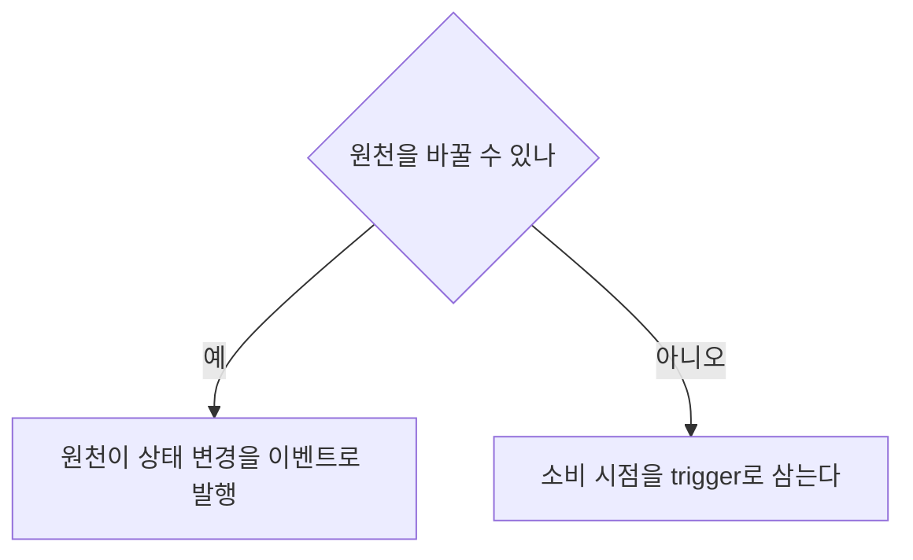

원천을 바꿀 수 있는지에 따라 trigger 자리를 다르게 옮겼다.
회원 정보·결제 상태·예약 목록, 세 원천 모두 변경 시점을 알려주지 않아 전수 조회 비용을 감당할 수 없었다.
이 글을 읽으면 여러 원천을 폴링으로 동기화할 때 trigger 위치를 고르는 기준 하나를 얻는다.
외부·내부 원천을 정기 폴링으로 동기화하며 규모가 커져 비용 문제를 겪는 백엔드 개발자를 위한 글이다.
답은 [trigger 자리를 원천마다 다르게 둔 절](#decision)에 있다.

{: #problem data-k="DESIGN"}
## 무엇을 바꿀 수 있고 없었나

셋 다 변경 시점을 알려주지 않는 원천이었지만, 원천 자체를 바꿀 수 있는지는 서로 달랐다.

| 원천 | 바꿀 수 있나 |
|---|---|
| 결제 상태 | 예 |
| 회원 정보 | 아니오 |

{: #decision data-k="DESIGN"}
## 원천을 바꿀 수 있는지에 따라 trigger 위치를 다르게 뒀다

| 원천 | trigger 위치 |
|---|---|
| 결제 상태 | 원천이 상태 변경을 Kafka topic으로 발행 |
| 회원 정보 | 서비스 접속 시점에 원천과 비교 |

예약 목록은 long polling과 캐시로 기존 REST 계약을 유지했다.

정리하면 원천을 바꿀 수 있으면 이벤트 발행으로 trigger를 원천 쪽에 뒀다. 바꿀 수 없으면 소비 시점을 trigger로 삼았다.

{: #limits data-k="DESIGN"}
## 이 구조가 틀리는 조건

접속 시점 비교(회원 정보 방식)는 접속 전 최신성을 보장하지 못한다.
