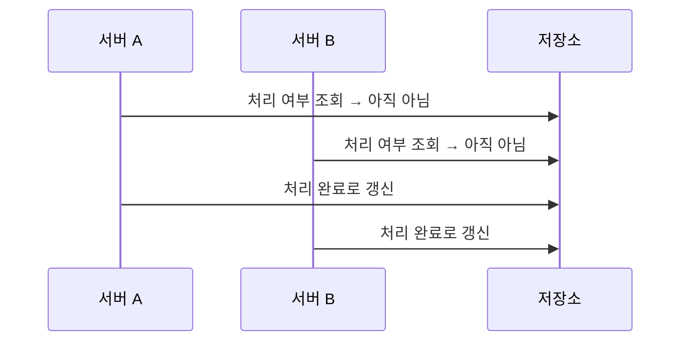
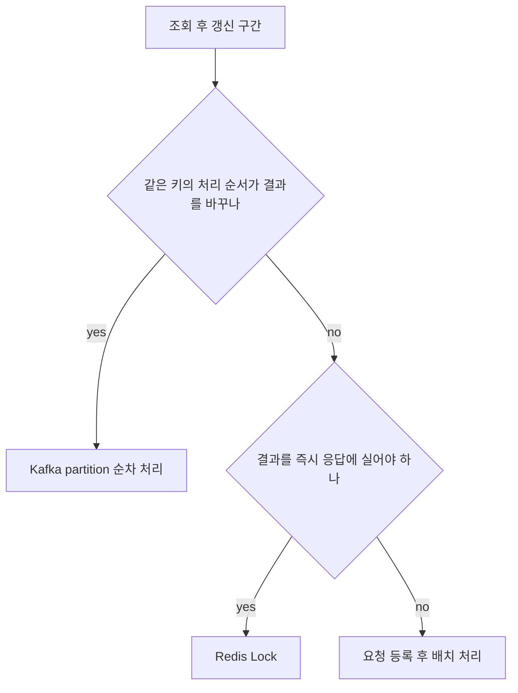

단일 서버로 잘 돌던 코드가 인스턴스를 늘린 뒤부터 같은 요청을 두 번 처리하고, 방금 쓴 값을 다른 서버가 덮어썼다.

깨진 것은 코드가 아니라 "조회와 갱신 사이에 아무도 끼어들지 않는다"는 전제였다. 배제 수단을 하나로 통일하는 대신 경합 지점의 성격에 따라 셋으로 나눠 적용한 기준을 적는다.

{: #problem data-k="DESIGN"}
## 조회와 갱신 사이가 비어 있었다

여러 프로젝트에서 같은 모양의 경합을 반복해 만났다. 공통점은 증설 시점에만 발현한다는 것이다.



*두 서버 모두 자기가 읽은 값 기준으로는 옳게 동작했다 — 틀린 것은 읽기와 쓰기 사이가 비어 있다는 전제다.*

임계 구역은 대개 이만큼 짧다. 아래는 실제 소스가 아니라 경합 구간만 남긴 개념 코드다.

```text
value = store.read(key)             # 다른 서버도 같은 시점에 같은 값을 읽는다
if not done(value):
    do_work(value)                  # 중복 처리
    store.write(key, next(value))   # 갱신 유실 — 나중 쓰기가 앞선 쓰기를 덮는다
```

단일 서버에서는 이 구간을 프로세스 안의 락이나 단일 스레드가 지켜 줬다. 서버가 둘이 되면 그 보호막만 사라지고 코드는 한 줄도 바뀌지 않는다. 리뷰와 테스트로는 걸리지 않는 유형이다.

{: #constraints data-k="DESIGN"}
## 제약 — 경합 지점마다 요구가 달랐다

| 제약 | 어디서 왔나 | 설계에 준 영향 |
|---|---|---|
| 조회-갱신 구간이 여러 인스턴스에서 동시에 실행된다 | 트래픽 증가에 따른 인스턴스 증설 | 프로세스 안의 동기화는 후보에서 빠진다 |
| 순서가 결과를 바꾸는 구간과 그렇지 않은 구간이 섞여 있다 | 도메인 | 순서까지 보장하는 수단과 배제만 하는 수단을 갈라 쓴다 |
| 즉시 반영이 필요한 작업과 아닌 작업이 섞여 있다 | 사용자 응답 경로에 걸리는지 여부 | 실시간으로 막지 않아도 되는 작업이 남는다 |
| 배제 비용이 처리량을 되돌리면 증설한 이유가 없어진다 | 증설의 목적 | 전 구간을 하나의 락으로 묶는 안은 후보에서 빠진다 |

제약 셋째 줄이 이 글의 갈림길이다. 요구가 한 종류였다면 수단도 하나로 끝났다.

{: #alternatives data-k="DESIGN"}
## 한 수단으로 통일하지 않은 이유

셋을 나란히 놓으면 마지막 열이 서로의 기각 근거가 된다.

| 수단 | 무엇으로 배제하나 | 같은 키의 처리 순서 | 지연 | 안 맞는 경우 |
|---|---|---|---|---|
| Kafka partition 순차 처리 | 같은 키를 같은 partition 으로 보내 consumer 하나가 차례로 처리 | 보장된다 | consumer lag 만큼 | 결과를 그 자리에서 응답에 실어야 하는 동기 API |
| Redis Lock | 임계 구역 진입 전에 키 하나를 선점, 만료 시간을 붙여 해제 누락에 대비 | 보장되지 않는다 — 진입 순서는 경쟁 결과다 | 락 대기 시간만큼 | 임계 구역이 길거나 외부 호출을 물고 도는 작업 |
| 요청 등록 후 배치 처리 | 요청만 적재하고 단일 실행 주체가 나중에 순차 처리 | 적재 순서대로 처리할 수 있다 | 배치 주기만큼 | 처리 결과를 즉시 보여줘야 하는 작업 |

Redis Lock 은 상호 배제만 준다. 순서가 결과를 바꾸는 구간에서는 배제에 성공해도 결과가 흔들린다.

{: #decision data-k="DESIGN"}
## 택한 구조 — 구간의 성격이 수단을 정한다



*수단을 먼저 고르고 구간을 맞추는 대신, 구간에 두 가지를 물어 수단을 정했다.*

어느 쪽으로 가든 먼저 정할 것은 같다. **경합 대상 식별자 하나**다.

- Kafka 에서 배제 단위는 partition key 다. producer 가 key 를 붙이면 같은 key 는 같은 partition 으로 가고, 그 partition 은 consumer group 안에서 한 consumer 만 읽는다. 식별자를 키로 쓰지 않으면 같은 자원이 여러 partition 으로 흩어지고 배제가 깨진다.
- Redis Lock 의 락 키도 같은 식별자다. `SET lock:자원id 소유자 NX PX 30000` 한 명령으로 선점과 만료를 함께 건다. 해제할 때는 값이 내 소유자 표식인지 확인하고 지운다 — 확인 없이 지우면 만료 뒤 잡힌 남의 락을 푼다.
- 만료 시간이 임계 구역 최장 소요보다 짧으면 락을 쥐었다고 믿는 주체가 둘이 된다. 이 값은 추측이 아니라 그 구간의 실측 소요에서 나와야 한다.
- 배치는 접수와 처리를 서로 다른 상태로 갈라 놓는다. API 와 화면이 "접수됨" 상태를 표현할 수 있어야 이 선택지가 성립한다.

{: #limits data-k="DESIGN"}
## 이 구조가 틀리는 조건

- 키가 한쪽으로 몰리면 partition 순차 처리는 그 키의 처리량을 consumer 하나에 묶는다. 배제는 유지되고 지연이 늘어난다.
- 락 저장소가 단일 장애점이 된다. 락을 얻지 못했을 때 요청을 거절할지 그냥 진행할지 미리 정해야 한다. 진행시키면 배제가 없는 것과 같다.
- 배치는 실시간성을 내주고 얻는 선택이다. 요구가 즉시 반영으로 바뀌는 날 이 구간은 처음부터 다시 설계해야 한다.
- 셋 다 애플리케이션 밖에 배제 지점을 둔다. 저장소가 조건부 갱신이나 버전 기반 낙관적 락을 제공한다면 그쪽이 더 짧은 경로일 수 있다. 그 비교는 당시 하지 않았다.

{: #checklist data-k="DESIGN"}
## 서버를 늘리기 전에 짚을 것

- 조회와 갱신 사이에 다른 요청이 끼어들면 결과가 달라지는 구간을 목록으로 뽑는다. 중복 처리 방지, 잔여 수량 차감, 상태 전이, 발송 이력이 늘 그 자리다.
- 구간마다 경합 대상 식별자를 하나 정한다. 이것이 partition key 이자 락 키다. 식별자를 못 고르면 경계가 아직 안 잡힌 것이다.
- 실행 주체가 하나라는 전제에 기대는 배치와 스케줄러를 찾는다. 이중화하는 순간 같은 작업이 두 번 돈다.
- 부하 테스트를 인스턴스 한 대로 돌리지 않는다. 이 결함은 단일 인스턴스에서 재현되지 않는다.

스케일아웃은 처리량을 주면서 경합을 함께 들여온다. 병렬화와 상호 배제는 같은 설계 단계에서 정한다.
