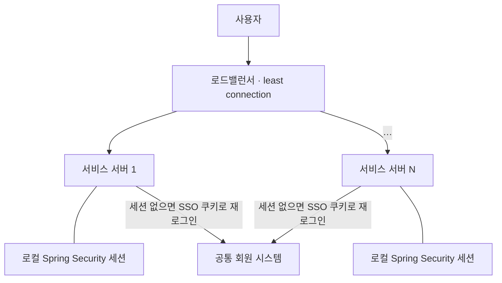

서버 N대 뒤에서 돌던 웹 서비스에서 APM이 공통 회원 시스템 로그인 호출을 비정상적으로 많이 잡았다. 사용자는 아무것도 못 느꼈다. 로드밸런서는 요청마다 연결이 적은 서버를 골랐고, Spring Security 세션은 그 서버 안에만 있었으며, 세션이 없으면 SSO 쿠키로 조용히 재로그인이 돌았다.

코드에는 결함이 없었다. 각자 옳은 세 결정이 만나 낭비를 만든 자리를 어떻게 찾았고, 왜 고정 분산이 끝이 아닌지 적는다.

{: #situation data-k="SITUATION"}
## 어디서, 무엇을 하다가

로그인이 두 겹인 웹 서비스다. 로그인 세션 자체는 회원 시스템 담당 조직이 관리하고, 각 서비스 애플리케이션은 자기 서비스 세션을 Spring Security 로 따로 들고 있었다. 서비스 서버는 N대였고 앞에 로드밸런서가 least connection 으로 요청을 나눴다.

*세션이 서버 안에 있으면 요청을 나누는 규칙이 곧 "공통 회원 시스템을 몇 번 부르나"를 정하는 규칙이 된다.*

요청 하나가 지나는 순서는 이렇다.

1. 서비스 로그인 — 서비스 서버가 Spring Security 세션을 만든다.
2. 이후 요청마다 서비스 서버의 Security 체크 — 세션이 있으면 통과.
3. 세션이 없고 SSO 쿠키가 있으면 — 그 쿠키로 공통 회원 시스템에 재로그인을 태워 세션을 다시 만든다.

세 번째 단계는 SSO 를 위해 넣은 것이다. 브라우저를 다시 열거나 세션이 만료돼도 사용자가 다시 로그인하지 않게 한다. 이 편의가 이 건의 전제다.

{: #symptom data-k="SYMPTOM"}
## 보이는 것

사용자 신고는 없었다. 증상은 Scouter 에서 봤다.

- 공통 회원 시스템 로그인 API 호출이 사용자 수·로그인 수에 비해 비정상적으로 많았다.
- 호출은 특정 사용자에 몰리지 않고 넓게 퍼져 있었다.
- 서비스 쪽 오류는 없었다. 재로그인이 매번 성공했기 때문이다.

당시 Scouter 화면과 호출 수는 남겨 두지 않았다. "정상 로그인 수보다 로그인 호출이 훨씬 많았다"는 모양만 적는다.

{: #diagnosis data-k="DIAGNOSIS"}
## 가설 → 확인

| 가설 | 확인 방법 | 판정 |
|---|---|---|
| 클라이언트가 로그인을 반복 호출한다 | 호출 주체와 경로를 APM 트랜잭션에서 확인 | 기각 — 호출 주체는 서비스 서버의 Security 체크였다 |
| 세션 만료 시간이 너무 짧다 | 세션 timeout 설정 확인 | 기각 — 만료로 설명될 빈도가 아니었다 |
| 요청이 세션 없는 서버로 간다 | 로드밸런서 분산 알고리즘과 세션 저장 위치를 나란히 확인 | 확인 — least connection, 세션은 서버 로컬 |

세 번째가 원인이다. 같은 사용자의 다음 요청이 연결이 적은 다른 서버로 가면 그 서버엔 Spring Security 세션이 없다. 세션이 없으니 3단계가 발동해 쿠키로 공통 회원 시스템 로그인을 다시 탄다. 서버가 N대면 같은 서버에 연속으로 붙을 확률은 대략 1/N 이라, 나머지 요청이 전부 로그인 호출이 된다.

{: #root-cause data-k="ROOT CAUSE"}
## 세 결정이 서로를 몰랐다

원인은 코드가 아니라 배포 형상에 있었다. 각자 옳은 세 결정이 함께 틀렸다.

- 로드밸런서는 연결이 적은 서버로 보낸다. 자원을 고르게 쓰려는 선택이다.
- 서비스는 세션을 서버 로컬에 둔다. 서버가 한 대일 때는 가장 단순한 선택이다.
- 세션이 없으면 SSO 쿠키로 재로그인한다. 사용자를 다시 로그인시키지 않으려는 선택이다.

세 번째 결정이 이 건을 특이하게 만들었다. 재로그인이 없었다면 사용자가 로그인 화면으로 튕겨 바로 신고가 들어왔을 것이다. 대신 문제가 공통 회원 시스템 호출량으로 옮겨 가 조용해졌다.

| 세션 저장 위치 | 요청 분산 규칙 | 세션이 유지되나 | 서버 대수를 바꾸면 |
|---|---|---|---|
| 서버 로컬 | 매 요청 연결·부하 기준(round-robin·least connection) | 아니다 — 다른 서버에 붙는 순간 세션이 없다 | 어긋날 확률만 커진다 |
| 서버 로컬 | 같은 사용자를 같은 서버로 고정(hash·sticky) | 그렇다 — 고정이 유지되는 동안만 | 대상 서버가 다시 계산돼 흔들린다 |
| 서버 밖 공용 저장소 | 무엇이든 | 그렇다 | 영향이 없다 |

*로컬 세션 행에서만 분산 규칙이 세션 유지 여부를 좌우한다. 세션을 밖으로 빼면 가운데 열의 값이 무의미해진다.*

{: #fix data-k="FIX"}
## 바꾼 것

분산 방식을 같은 사용자의 요청이 같은 서버로 가도록 고정하는 쪽으로 바꿨다. 공통 회원 시스템 로그인 호출은 정상 로그인 수 근처로 내려왔다.

감수한 것은 셋이다.

- 부하가 고르게 나뉘지 않는다. 고정 결과가 한쪽으로 쏠려도 그대로 둔다.
- 서버를 추가하거나 빼면 사용자와 서버의 대응이 다시 계산된다. 그 순간 붙어 있던 세션은 사라지고, 사라진 만큼 재로그인 호출이 한 번씩 튄다.
- 서버 한 대가 죽으면 그 서버가 들고 있던 세션도 함께 죽는다.

세션을 로컬에 두는 전제를 그대로 둔 처방이다. 증상은 멈췄지만 원인은 그 자리에 있다.

{: #prevention data-k="PREVENTION"}
## 다시 안 겪으려면

| 넣은 것 | 무엇을 막나 | 아직 못 막는 것 |
|---|---|---|
| 사용자와 서버를 고정하는 분산 | 요청마다 다른 서버에 붙어 세션을 잃는 것 | 서버 증감·장애로 대응이 바뀌는 순간 |
| 세션 저장 위치와 분산 정책을 한 쌍으로 확인 | 두 결정이 서로를 모른 채 따로 내려지는 것 | 이미 그렇게 배포돼 돌고 있는 시스템 |
| 공통 회원 시스템 로그인 호출 수를 로그인 수와 대조하는 지표 | 재로그인이 증상을 숨긴 채 호출량으로 새는 것 | 지표를 보는 사람이 없으면 여전히 조용하다 |
| 세션 외부화 — 기준으로만 남김 | 분산 규칙과 무관하게 세션이 유지된다 | 넣지 않았다. 지금 구성은 위 세 줄에 기대고 있다 |

*세션 외부화 없이는 위 세 줄이 서버 대수를 바꾸는 날 다시 깨진다 — 앞의 세 줄은 증상을 늦출 뿐이다.*

같은 증상을 만나면 코드보다 먼저 두 가지를 나란히 본다. 로드밸런서가 어떤 규칙으로 요청을 나누는지, 세션이 어디에 저장되는지. 하나만 알면 원인이 보이지 않는다.

그리고 재로그인을 자동으로 태우는 구조라면 사용자 신고를 기다리지 말라. 이 건은 사용자 쪽에서는 끝까지 정상이었다. 낭비는 APM 의 호출 수에만 남았다.

고정 분산으로 증상을 멈췄다면 거기서 끝내지 않는 편이 낫다. 서버 대수를 바꾸는 날 같은 호출량이 돌아온다. 세션을 서버 밖으로 빼는 것이 근본 해법이다. Spring Session 으로 Redis 같은 공용 저장소에 두든, 서버가 상태를 들지 않는 토큰 방식으로 가든.
