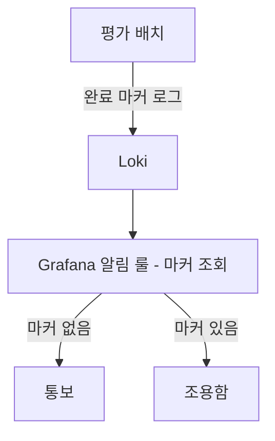
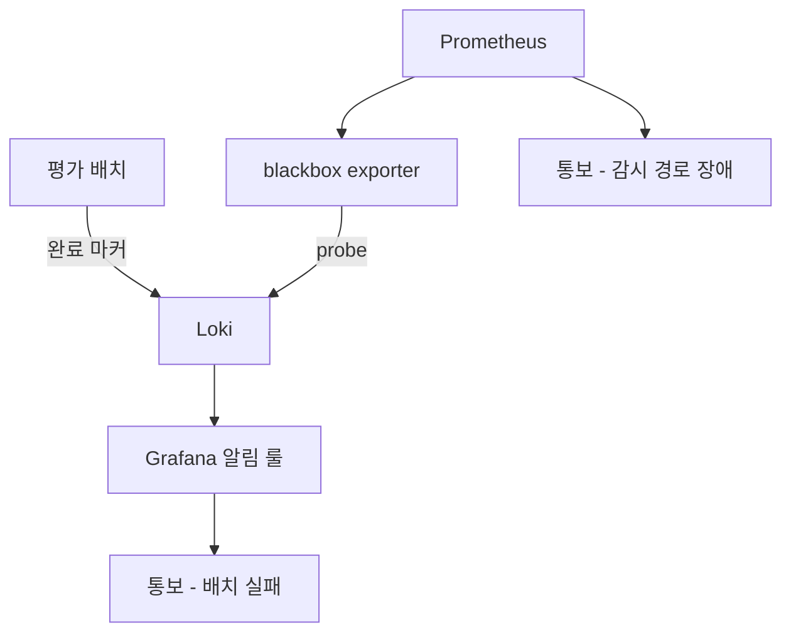

평가 배치가 실패하면 알려 주도록 Grafana 알림을 걸어 두고, 알림이 오지 않는 것을 정상으로 읽었다.
알림 룰이 조회하던 단일 노드 Loki 가 ring heartbeat stale 로 읽기·쓰기 모두 500 을 내고 있었다.
감시 경로가 죽었을 때 알림이 침묵하는 이유와 그 침묵을 깨는 방법을 적는다.

{: #situation data-k="SITUATION"}
## 어디서, 무엇을 하다가

외부 SaaS 를 쓸 수 없어 관측 스택을 직접 띄워 굴리는 개발·PoC 환경이다. Langfuse, ClickHouse, MinIO,
Prometheus, Grafana, Loki 를 컨테이너로 올렸고 노드는 한 대다.

LLM 응답을 주기적으로 채점하는 평가 배치가 있다. 배치는 실행이 끝나면 완료 마커를 로그로 남기고,
그 로그는 Loki 로 들어간다. Grafana 알림 룰이 그 마커를 조회해서, 정해진 시간 안에 마커가 없으면
통보한다. 스케줄러가 조용히 죽는 걸 잡으려고 만든 룰이다.



*알림 경로가 감시 대상과 같은 저장소를 지난다 — 이 한 점이 뒤 절의 전부다.*

{: #symptom data-k="SYMPTOM"}
## 보이는 것

증상이 없었다. 그게 증상이었다.

- 알림이 한 건도 오지 않았다. 조용한 알림은 배치가 잘 돌고 있다는 뜻으로 읽힌다.
- `docker ps` 는 Loki 컨테이너를 Up 으로 보여 줬다. 재시작 카운트도 그대로였다.
- Grafana 에서 로그 패널을 열었더니 최근 구간이 비어 있었다. 여기서 처음 이상하다고 봤다.

패널이 비어 있는 것과 로그가 없는 것은 다르다. 그래서 Loki 를 직접 찔렀다.

```bash
curl -s -o /dev/null -w '%{http_code}\n' http://localhost:3100/ready
curl -s -o /dev/null -w '%{http_code}\n' http://localhost:3100/loki/api/v1/labels
```

`/ready` 도, 조회 API 도 200 이 아니었다. 로그를 밀어 넣는 쪽도 같이 막혀 있었다. 읽기와 쓰기가
동시에 실패하고 있었다.

{: #diagnosis data-k="DIAGNOSIS"}
## 가설 → 확인

| 가설 | 확인 방법 | 판정 |
|---|---|---|
| 평가 배치가 멈춰서 마커도 알림도 없다 | 배치 실행 이력과 로컬 출력을 직접 확인 | 기각 — 배치는 계속 정상 실행됐다 |
| Loki 컨테이너가 내려갔다 | `docker ps` 의 상태와 재시작 카운트 | 기각 — Up, 재시작 없음 |
| 컨테이너는 살았지만 Loki 가 요청을 못 받는다 | `/ready` 와 조회 API 를 직접 호출 | 확인 — 읽기·쓰기 모두 500 |

셋째 행이 갈림길이다. 앞의 두 확인은 "프로세스가 살아 있다" 까지만 말해 주는데, 나는 그걸
"서비스가 동작한다" 로 읽고 있었다.

단일 노드 구성이어도 Loki 는 내부적으로 ring 에 자기 자신을 등록하고 heartbeat 를 갱신한다.
ring 상태는 HTTP 로 볼 수 있다.

```bash
curl -s http://localhost:3100/ring
```

자기 자신이 UNHEALTHY 로 잡혀 있었다. heartbeat 가 갱신되지 않은 채 stale 로 굳은 상태였고,
그 동안 write 와 read 가 함께 거절되고 있었다.

계기는 호스트 절전으로 보인다. 절전에 들어갔다 깨어난 뒤부터 시각이 점프했고 heartbeat 판정이 어긋났다.
어느 시계가 어떻게 어긋나 stale 이 자동 회복되지 않았는지까지는 파지 않았다. 원인이 시계 점프라는
것과 재기동으로 풀린다는 것까지만 확인했다.

{: #root-cause data-k="ROOT CAUSE"}
## 왜 소리가 나지 않았나

Loki 가 죽은 건 알겠는데, 알림 룰은 왜 아무 말도 안 했나. 룰이 만나는 상황은 두 가지가 아니라
세 가지다.

| 룰이 만난 상황 | 룰의 결과 | 통보 |
|---|---|---|
| 마커가 있다 | 조건 불충족 (Normal) | 없음 — 이게 정상이다 |
| 마커가 없다 | 조건 충족 (Alerting) | 발화 |
| 조회 자체가 실패한다 | 평가 불가 (Error / No data) | 어떻게 다룰지 정해 두지 않으면 조용하다 |

Grafana 알림 룰은 조회가 실패한 경우와 결과가 빈 경우를 조건 판정과 별개의 상태로 둔다.
그 상태를 발화로 볼지, 정상으로 볼지, 직전 상태를 유지할지는 룰마다 고른다. 나는 그 자리를 손대지
않았다. 룰을 만들 때 머릿속에 있던 세계는 "마커가 있다/없다" 두 칸뿐이었다.

결과가 고약하다. 이 기간에 평가 배치가 실제로 실패했더라도 나는 몰랐다. 배치가 정상이었던 건
운이지 감시의 성과가 아니다.

{: #fix data-k="FIX"}
## 바꾼 것

헬스 판정과 감시 경로, 두 가지를 바꿨다.

**헬스 판정을 컨테이너 상태에서 `/ready` 로 옮겼다.** 컨테이너 Up 은 프로세스가 살아 있다는 뜻이지
요청을 처리한다는 뜻이 아니다. `/ready` 는 Loki 가 자기 준비 상태를 판정해 답한다.

```yaml
healthcheck:
  test: ["CMD-SHELL", "wget -q -O- http://localhost:3100/ready || exit 1"]
  interval: 30s
  retries: 3
```

**Loki 에 의존하는 알림을 Loki 밖에서 감시하도록 분리했다.** blackbox exporter 가 Loki 엔드포인트를
바깥에서 찔러 보고 그 결과를 Prometheus 가 긁어 간다. Loki 가 못 답하면 Prometheus 쪽 알림이 뜬다.



*경보 경로가 둘로 갈라졌다 — 감시 대상의 장애와 감시 자체의 장애가 서로 다른 저장소를 지난다.*

대가는 컴포넌트가 하나 늘고 통보 경로가 둘이 된 것이다. 대신 한쪽이 죽어도 다른 쪽이 남는다.
Prometheus 가 같이 죽으면 이 구조도 조용해지는데, 그건 다음 절이다.

{: #prevention data-k="PREVENTION"}
## 다시 안 겪으려면

| 넣은 것 | 무엇을 막나 | 아직 못 막는 것 |
|---|---|---|
| `/ready` 기반 헬스체크 | 프로세스는 살고 서비스는 죽은 상태를 Up 으로 읽는 것 | `/ready` 는 200 인데 특정 쿼리만 실패하는 경우 |
| blackbox exporter → Prometheus 로 감시 경로 분리 | Loki 장애를 Loki 로 감시하는 순환 | Prometheus 와 Grafana 가 같이 죽는 경우 |
| 알림 룰의 Error / No data 처리를 명시 | 조회 실패가 침묵으로 끝나는 것 | 룰을 새로 만들 때 또 빼먹는 것 |

마지막 구멍이 크다. 지금 구조는 감시하는 쪽이 통째로 죽으면 여전히 조용하다. 스택 바깥에서
주기적으로 신호를 받다가 그게 끊기면 알리는 heartbeat — dead-man's switch — 를 별도 요건으로
뽑아 뒀지만 아직 붙이지 않았다. 그때까지는 이 구조도 "조용함" 을 증거로 쓸 수 없다.

그래서 지금 쓰는 기준은 셋이다.

- 알림이 조용한 것은 정상의 증거가 아니다. 정상의 증거는 정상이라고 말해 주는 신호다.
- 알림 룰은 조건 참·거짓 두 칸이 아니라 평가 불가 칸까지 세 칸을 채운다.
- 감시 컴포넌트를 감시하는 경로는 감시 대상과 다른 저장소를 지나야 한다.

같은 증상을 만났으면 컨테이너 상태 말고 `/ready` 와 `/ring` 부터 찔러 보라. 이 장애에서 `docker ps`
는 아무것도 말해 주지 않는다.
