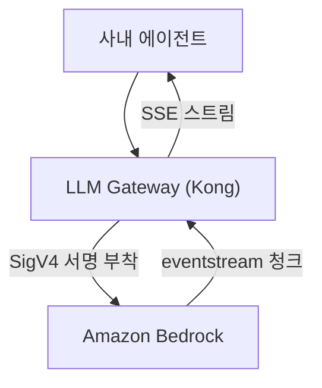

사내 LLM 게이트웨이(Kong) 뒤에서 Bedrock 을 스트리밍으로 부르는데 긴 응답만 중간에 끊겼다.
응답 파서의 AWS eventstream 분기에만 carry-over 버퍼가 없어, 청크 끝이 프레임 경계와 어긋나면
꼬리가 버려졌다. 응답 크기 말고 절단점의 위치를 보는 순서를 적는다.

{: #situation data-k="SITUATION"}
## 어디서, 무엇을 하다가

AI 게이트웨이를 사내에 두는 조직이다. 서비스가 모델을 직접 부르지 않고, 인증·연결·관측을
게이트웨이 한 경계로 모았다.



*응답은 게이트웨이 안에서 한 번 파싱된 뒤 다시 조립돼 나간다 — 절단은 모델도 클라이언트도 아닌 그 중간에서 생길 수 있다.*

스트리밍 route 를 구성한 직후부터 보였다.

{: #symptom data-k="SYMPTOM"}
## 보이는 것

- 짧은 응답은 끝까지 정상으로 왔다.
- 긴 출력에서 응답이 중간에 끊기고 스트림이 닫혔다.
- 같은 요청을 단발로 다시 보내면 재현되지 않았다.
- 부하를 주며 반복 호출해야 재현됐다.

단발 재시도가 매번 성공한 탓에 처음에는 일시적 네트워크 문제로 봤다. 재현 조건을 "부하를 준 반복
호출" 로 좁히고 나서야 이 증상에 규칙이 있다는 걸 인정했다.

{: #diagnosis data-k="DIAGNOSIS"}
## 가설 → 확인

| 가설 | 확인 방법 | 판정 |
|---|---|---|
| 일시적 네트워크 문제 | 같은 요청을 단발로 재시도 | 기각 — 부하를 주면 매번 났다. 조건이 있으면 일시적 장애가 아니다 |
| 응답이 길어 어떤 상한에 걸린다 | 짧은 응답과 긴 응답을 갈라 호출 | 보류 — 상관은 보였지만 걸리는 상한 값이 나오지 않았다 |
| 게이트웨이 파서의 nil 체크 누락 | 게이트웨이 소스 감사 | 증상으로 재분류 — nil 이 들어온다는 것 자체가 결과였다 |
| 청크 경계가 프레임 경계와 어긋난다 | 같은 함수의 응답 분기 셋에서 carry-over 처리를 대조 | 확인 — eventstream 분기에만 없었다 |

기각한 가설 둘을 남겨 둔다. 특히 두 번째는 오래 붙잡고 있었다. 크기와 상관이 보이면 상한을 찾게
되는데, 이 문제에는 상한이 없었다.

소스를 감사해 원인 1건과 증상 4건을 갈랐다. 결정적인 건 같은 함수 안의 분기 대조였다.

| 응답 분기 | 언제 추가됐나 | 잘린 꼬리를 다음 청크에 이어 붙이나 |
|---|---|---|
| 표준 SSE | 먼저 | 있다 |
| Gemini | 먼저 | 있다 |
| AWS eventstream | 나중 | **없다** |

먼저 만들어진 분기가 사고를 겪고 얻은 방어 로직이, 나중에 붙은 분기로 상속되지 않았다.
방어 로직은 코드 단위가 아니라 분기 단위로 늙는다.

{: #root-cause data-k="ROOT CAUSE"}
## 경계를 정하는 주체가 둘이다

AWS eventstream 은 길이 필드로 프레임을 자른다. 프레임의 첫 4바이트가 그 프레임의 전체 길이다.

```text
[ total byte-length : 4B ][ headers byte-length : 4B ][ prelude CRC : 4B ]
[ headers ... ][ payload ... ][ message CRC : 4B ]
```

이 값을 다 채우기 전에는 프레임 하나가 끝나지 않는다. 그런데 TCP 는 메시지 경계를 보존하지 않는다.
네트워크가 청크를 어디서 끊을지는 이 길이 필드와 아무 관계가 없다.

<figure class="fig">
<div class="fig-scroll">
<svg viewBox="0 0 620 168" role="img" aria-label="TCP 청크의 끝이 길이 필드가 정한 프레임 경계와 어긋나, 청크 하나가 프레임 중간에서 끝난다">
  <text class="d-band" x="8" y="16">① 길이 필드가 정하는 프레임 경계</text>
  <rect class="d-box" x="8"   y="26" width="196" height="38" rx="2"/>
  <rect class="d-box" x="208" y="26" width="196" height="38" rx="2"/>
  <rect class="d-box" x="408" y="26" width="196" height="38" rx="2"/>
  <text class="d-t" x="106" y="50" text-anchor="middle">프레임 A</text>
  <text class="d-t" x="306" y="50" text-anchor="middle">프레임 B</text>
  <text class="d-t" x="506" y="50" text-anchor="middle">프레임 C</text>

  <text class="d-lbl d-em" x="8" y="88">청크 1 은 프레임 A 한가운데서 끝난다 — 이 꼬리를 들고 있어야 한다</text>

  <text class="d-band" x="8" y="112">② TCP 가 끊어 주는 청크 경계</text>
  <rect class="d-box d-alt" x="8"   y="122" width="140" height="38" rx="2"/>
  <rect class="d-box d-alt" x="152" y="122" width="200" height="38" rx="2"/>
  <rect class="d-box d-alt" x="356" y="122" width="248" height="38" rx="2"/>
  <text class="d-t2" x="78"  y="146" text-anchor="middle">청크 1</text>
  <text class="d-t2" x="252" y="146" text-anchor="middle">청크 2</text>
  <text class="d-t2" x="480" y="146" text-anchor="middle">청크 3</text>

  <line class="d-l d-dash d-em" x1="148" y1="26" x2="148" y2="160"/>
  <line class="d-l d-dash d-em" x1="352" y1="26" x2="352" y2="160"/>
</svg>
</div>
<figcaption>경계를 정하는 주체가 둘이라 어긋남은 예외가 아니라 기본값이다 — 짧은 응답이 성공한 건 우연히 정렬됐을 때뿐이고, 정렬을 보장하는 설정은 없었다.</figcaption>
</figure>

변수는 응답 크기가 아니라 **절단점의 위치**였다. 크기는 절단점 개수를 늘려 어긋날 기회를 늘렸을 뿐이다.
그래서 부하를 줘야 재현됐다. 절단점이 흩어져야 어긋난 자리가 나온다.

{: #fix data-k="FIX"}
## 바꾼 것

수리 대상은 하나로 특정됐다. eventstream 분기에 carry-over 버퍼를 두는 것이다.

아래는 실제 게이트웨이 소스가 아니라, 세 분기가 공유해야 하는 개념 골격이다. 핵심은 ③ — 프레임이
덜 왔을 때 버퍼를 **버리지 않고 그대로 두는** 자리다.

```python
buf = b""                       # 지난 청크에서 남은 꼬리

def on_chunk(chunk):
    global buf
    buf += chunk                # ① 먼저 이어 붙인다
    while True:
        if len(buf) < 4:
            return              # ② 길이 필드조차 아직 안 왔다
        total = int.from_bytes(buf[:4], "big")
        if len(buf) < total:
            return              # ③ 프레임이 덜 왔다 — 버리지 않는다
        emit(buf[:total])
        buf = buf[total:]       # ④ 남은 꼬리가 다음 청크의 앞이 된다
```

자기 파서에서 볼 곳은 한 줄이다. 청크 핸들러가 호출 사이에 살아남는 버퍼를 들고 있는가,
아니면 매 호출 지역 변수로 새로 시작하는가. 후자면 이 글의 증상이 아직 안 나왔을 뿐이다.

증상 4건을 먼저 고쳤다면 어땠을지도 적어 둔다. nil 체크만 채우면 게이트웨이는 터지지 않는다.
대신 응답은 그대로 잘린 채 스트림이 정상 종료로 닫힌다. 증상 수리는 이 문제를 더 조용하게 만들 뿐이라고 봤다.

{: #prevention data-k="PREVENTION"}
## 다시 안 겪으려면

수치로 남길 조치가 아니라 다음에 같은 판단을 하려고 세운 기준이다.

| 세운 기준 | 무엇을 막나 | 아직 못 막는 것 |
|---|---|---|
| 간헐적 절단은 크기가 아니라 절단점의 위치를 변수로 놓는다. 부하로 절단점을 흩는 재현부터 만든다 | 단발 재시도가 성공해 "일시적 네트워크" 로 닫히는 오진 | 절단점이 늘 같은 자리에 오는 환경에서는 이 재현도 안 된다 |
| 응답 파서에 분기를 추가할 때 기존 분기의 방어 로직과 항목별로 대조한다 | 먼저 만들어진 분기의 사고 이력이 새 분기로 상속되지 않는 구조 | 대조는 사람이 한다 — 프레임 조립을 한 곳으로 모으기 전에는 분기가 늘 때마다 다시 벌어진다 |
| 스트리밍을 켤 때 "메시지 경계를 누가 복원하나" 를 설계 항목으로 적는다 | 동기 호출에서 HTTP 스택이 대신 해 주던 일을 아무도 안 하는 상태 | carry-over 버퍼 자체의 상한. 길이 필드가 손상되면 오지 않을 프레임을 기다리며 버퍼가 자란다 |

스트리밍은 메시지 경계를 복원할 책임이 HTTP 스택에서 애플리케이션으로 옮겨오는 일이다.
이 문장을 그대로, 모델 호출을 당분간 동기 방식으로 두는 과도기 표준의 설계 근거로 재사용했다.
