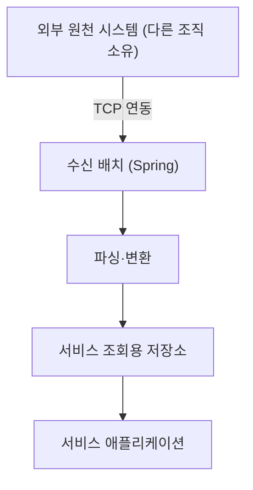
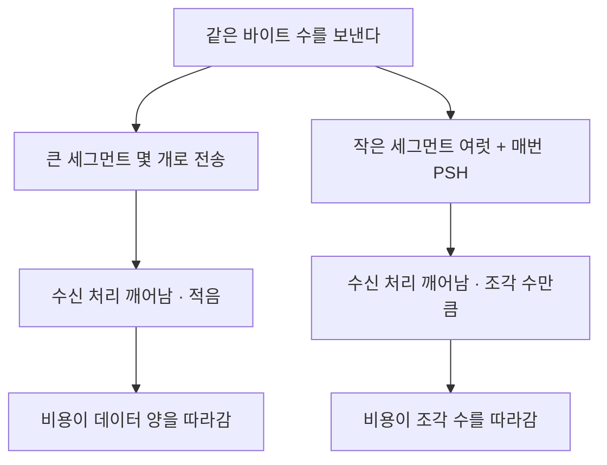

다른 조직의 원천 시스템에서 TCP 로 받는 대량 데이터 동기화가 데이터가 많을수록 느려졌다. socket read buffer를 올려도 그대로였고, 패킷 덤프를 뜨자 원인은 송신 측의 전송 단위였다. 지연을 바이트로 보고 튜닝하다 막혔다면 "수신이 깨어난 횟수"로 바꿔 보라는 이야기다.

{: #situation data-k="SITUATION"}
## 어디서, 무엇을 하다가

Spring 기반 수신 배치로 외부 원천 시스템의 데이터를 주기적으로 받아 서비스가 읽는 저장소에 채우는 일이었다. 원천은 다른 조직이 운영하는 시스템이다.



*원천은 다른 조직 소유다 — 이 경계가 어디까지가 우리 문제인지를 정하고, 나중에 조치 위치도 정한다.*

증상은 두 가지 모양으로 보였다.

- 받아 올 데이터가 많은 시간대일수록 동기화가 느려졌다.
- 한 번에 많이 받도록 묶어도 이득이 없었다. 오히려 회당 비용이 커지는 쪽에 가까웠다.

두 번째가 이상했다. 대량 전송은 보통 한 번에 크게 받을수록 건당 비용이 내려간다. 그 반대가 나온다는 건 비용을 만드는 단위가 데이터 양이 아니라는 뜻이다.

이때 우리 쪽 코드에는 잡을 결함이 없었다. 파싱도 적재도 데이터 양에 비례하는 정도였다.

{: #diagnosis data-k="DIAGNOSIS"}
## 가설 → 확인

| 가설 | 확인 방법 | 판정 |
|---|---|---|
| 수신 buffer가 작아 여러 번 나눠 읽는다 | socket read buffer를 올려 같은 시간대 재실행 | 기각 — 소요 시간에 차이가 없었다. 실측치는 남기지 않아 정성 판정이다 |
| 그냥 데이터가 많아서 느린 것이다 | 수신 묶음을 키워 회당 처리량을 올림 | 기각 — 건당 비용이 안 내려갔다 |
| 네트워크 구간에 손실·재전송이 있다 | 인프라 담당자와 패킷 덤프 확인 | 기각 — 재전송이 원인일 모양이 아니었다 |
| 송신 측이 보내는 단위가 잘다 | 같은 덤프에서 세그먼트 크기와 flag 분포 확인 | 확인 — 작은 세그먼트마다 PSH |

기각한 셋을 남겨 둔다. 앞의 두 줄에 시간을 가장 많이 썼고, 같은 증상을 만난 사람도 거기부터 시작할 것이기 때문이다.

buffer 가설이 기각된 시점이 갈림길이었다. 수신 측 파라미터를 하나씩 더 만져 보는 대신, Wireshark로 실제로 무엇이 오는지 뜨기로 하고 인프라 담당자와 함께 봤다.

```text
tcp.stream eq 0 && tcp.flags.push == 1
```

*당시 쓴 필터를 기록해 두지 않았다. 위 한 줄은 같은 상황을 다시 볼 때 쓰는 표시 필터로, 이 스트림에서 PSH가 실린 세그먼트만 남긴다. 전체 세그먼트 수 대비 이 결과의 비율과 각 세그먼트의 길이를 같이 본다.*

원천은 한 덩어리를 보낼 때도 작은 조각으로 나눠 보내고 있었고, 조각마다 PSH flag가 실려 있었다.

{: #root-cause data-k="ROOT CAUSE"}
## 조각 수만큼 깨어난 수신



*같은 데이터라도 전송 단위가 다르면 수신 쪽이 치르는 값이 달라진다 — 이 그림은 개념도이고 측정 결과가 아니다.*

PSH는 "지금까지 받은 걸 애플리케이션으로 밀어 올려라"라는 신호다. 송신이 데이터를 잘게 끊고 조각마다 이 신호를 실으면, 수신 쪽에서는 커널이 모아 두었다가 한 번에 넘기는 여지가 줄어든다. 그러면 읽기 처리가 조각 수만큼 깨어난다.

패킷 수와 처리 횟수가 함께 늘어난 것으로 봤다. 데이터가 많아질수록 조각도 많아지니 증상은 양에 따라 심해졌고, 한 번에 크게 받으려는 시도는 조각 수를 그대로 둔 채 회당 조각만 늘렸으니 효과가 없었다.

정확히 하자면, PSH 하나가 수신 앱의 wake-up을 규격상 강제하는 건 아니다. 스택 구현과 소켓 설정에 달렸다. 우리가 확인한 건 "이 연동에서 조각 수와 처리 횟수가 함께 움직였다"는 사실이고, 조각을 만들지 않게 하자 증상이 사라졌다는 것까지다.

{: #fix data-k="FIX"}
## 바꾼 것

| 누가 | 무엇을 | 왜 거기였나 |
|---|---|---|
| 송신 측(원천 시스템 조직) | 전송 방식을 고쳐 조각내 밀어내지 않도록 | 조각을 만드는 주체라 비용의 발생 지점이 거기였다 |
| 우리(수신 측) | 되돌린 것 없음 — buffer 조정은 효과가 없어 그대로 두거나 원복 | 수신에서 조각을 되붙여도 이미 늘어난 처리 횟수는 줄지 않는다 |
| 아무도 | 애플리케이션 파싱·적재 로직 | 여기엔 결함이 없었다. 고쳤으면 증상만 옅어지고 원인은 남았을 것 |

대가는 일정이었다. 고쳐야 할 코드가 다른 조직 소유라, 우리 손으로 배포해 끝낼 수 있는 문제가 아니었다. 그래서 "느리다"가 아니라 "이 연동에서 세그먼트가 이렇게 쪼개져 오고, 그 수만큼 수신 처리가 깨어난다"를 덤프로 같이 보면서 협의했다. 계측 결과가 없었으면 이 대화는 서로 상대 시스템을 의심하는 데서 끝났을 것이다.

{: #prevention data-k="PREVENTION"}
## 다시 안 겪으려면

| 넣은 것 | 무엇을 막나 | 아직 못 막는 것 |
|---|---|---|
| 연동 성능 이슈에서 수신 파라미터를 두 번 만져 안 되면 패킷부터 뜬다 | 가설을 계속 갈아 끼우며 시간 쓰는 것 | 상시 계측은 아니다. 증상이 났을 때 사람이 떠야 한다 |
| 연동 규격 협의에 전송 단위·묶음 크기를 항목으로 넣는다 | 송신 편의로 정해진 단위가 그대로 굳는 것 | 이미 운영 중인 연동, 규격을 못 바꾸는 상대 |
| "양에 비례하지 않는 지연"을 별도 신호로 본다 | 양 탓으로 넘기고 튜닝을 반복하는 것 | 원인이 송신 측일 때 우리 쪽 조치만으로는 못 끝낸다 |

이 방법이 안 통하는 조건이 있다. 송신 측이 외부 벤더라 전송 방식을 안 바꿔 주면, 남는 선택지는 수신에서 읽기 횟수를 줄이도록 소켓과 읽기 루프를 손보는 쪽인데 그건 검증해 보지 못했다.

같은 증상을 만나면 순서는 이렇다. 수신 buffer를 한 번 올려 보고 변화가 없으면 거기서 멈추고, 덤프를 떠서 세그먼트 길이 분포와 PSH 비율을 본다. 조각이 잘고 PSH가 거의 모든 세그먼트에 붙어 있으면, 고칠 곳은 받는 쪽이 아니다.

전송 단위는 송신 편의가 아니라 수신 처리 비용으로 정한다.
