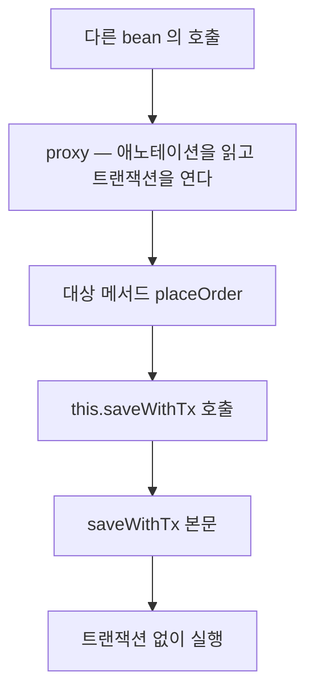

트랜잭션이 걸려 있어야 할 구간에서 롤백이 되지 않았다. 같은 bean 안에서 부른 메서드라 Spring AOP proxy 를
지나지 않았고, 애노테이션은 읽히지 않았다. 예외도 경고도 없는 실패라서, 무엇을 보면 이 원인이 갈리는지와
`@Async` 까지 같은 규칙으로 어떻게 넓혔는지를 적는다.

{: #situation data-k="SITUATION"}
## 어디서, 무엇을 하다가

Spring 기반 백엔드 서비스다. 서비스 메서드에 `@Transactional` 을 붙여 쓰는 흔한 구성이었다.

Spring 의 기본 AOP 는 proxy 방식이다. 애노테이션은 대상 클래스에 붙지만, 그것을 읽고 트랜잭션을 여는 쪽은
대상 클래스를 감싼 proxy 다.



*호출이 bean 밖에서 들어올 때만 proxy 를 지난다 — 안에서 시작한 호출에게 애노테이션은 주석과 같다.*

최소 형태는 이렇게 생겼다. 아래는 실제 서비스 코드가 아니라 같은 구조를 줄인 일반 패턴이다.

```java
@Service
public class OrderService {

    // 외부에서 부르면 proxy 를 지난다
    public void placeOrder(Order order) {
        saveWithTx(order);   // 같은 bean 안의 호출 — 여기서 proxy 가 빠진다
    }

    @Transactional
    public void saveWithTx(Order order) {
        orderRepository.save(order);
        pointRepository.deduct(order);   // 예외가 나도 위 save 는 남는다
    }
}
```

{: #symptom data-k="SYMPTOM"}
## 보이는 것 — 아무것도 안 보인다

이 결함의 증상은 로그가 아니라 침묵이다. 애노테이션 문법이 맞고 실행도 끝까지 되니 실패 신호가 없다.

| 볼 만한 곳 | 무슨 신호가 있나 | 왜 안 걸리나 |
|---|---|---|
| 애플리케이션 로그 | 없음 | 애노테이션이 안 걸린 것은 그 자체로 오류가 아니다 |
| 컴파일러·IDE 경고 | 없음 | 애노테이션은 문법에 맞게 붙어 있다 |
| 기능 테스트 | 통과 | 성공 경로만 보면 통과한다. 실패 뒤 데이터가 되돌아갔는지는 따로 단정해야 한다 |
| 데이터 | 뒤늦게 어긋남 | 부분 반영된 행이 남지만, 쌓이기 전에는 눈에 안 띈다 |

롤백이 안 된다는 것을 장애가 날 때까지 몰랐다. 원인 규명보다 발견이 늦은 쪽이 이 결함의 성격이다.

{: #root-cause data-k="ROOT CAUSE"}
## proxy 를 거쳤는지 가르는 법

지금 같은 증상을 만나면 아래 순서로 가른다. 당시 밟은 진단 순서가 아니라, 이 원인을 확정하는 데
필요한 최소 확인으로 정리한 것이다. 셋 다 코드를 고치기 전에 답이 나온다.

| 확인 | 무엇을 보나 | proxy 미경유면 |
|---|---|---|
| `AopUtils.isAopProxy(bean)` | 주입받은 bean 이 proxy 인가 | `false` — AOP 가 아예 안 걸린 별개 경우다 |
| 의심 메서드 안에서 `TransactionSynchronizationManager.isActualTransactionActive()` | 지금 실제 트랜잭션에 참여 중인가 | `false` — 애노테이션이 붙었는데도 그렇다 |
| 트랜잭션 인터셉터 로그 | 어느 메서드에서 경계가 열리는가 | 그 메서드 이름이 로그에 안 찍힌다 |
| 호출부의 위치 | 호출이 같은 클래스 안인가 | `this.` 로 시작하면 그것으로 확정이다 |

```properties
# 트랜잭션 경계가 어디서 열리는지 찍어 본다
logging.level.org.springframework.transaction.interceptor=TRACE
```

두 번째 확인은 애노테이션이 아니라 런타임 사실을 본다는 점에서 값이 있다. 바깥에 이미 트랜잭션이
열려 있으면 `true` 가 나오므로, 원인 판정은 호출부 위치까지 같이 봐야 끝난다.

{: #fix data-k="FIX"}
## 바꾼 것

호출부를 다른 bean 으로 분리해 proxy 를 지나게 했다. 애노테이션은 그대로 두고 호출 경로만 옮긴 것이다.

| 방법 | proxy 를 어떻게 되찾나 | 대가 |
|---|---|---|
| 다른 bean 으로 분리 (택함) | 호출이 bean 밖에서 들어오니 proxy 를 지난다 | 클래스가 늘고 책임 경계를 다시 나눠야 한다 |
| self-injection | 주입받은 자기 참조가 proxy 다 | 왜 자기를 주입했는지 코드만 보고는 모른다 |
| `TransactionTemplate` | AOP 를 안 쓰고 경계를 코드로 연다 | 선언성이 사라지고 본문이 콜백 안으로 들어간다 |
| AspectJ 위빙 | proxy 없이 바이트코드를 고친다 | 빌드·기동 설정이 늘고 팀 전체가 그 전제를 알아야 한다 |

앞의 셋은 호출을 proxy 밖에서 시작하게 만드는 처방이고, 마지막 하나는 proxy 라는 전제 자체를 버린다.
한 곳을 고치자고 위빙을 들이지는 않았다.

{: #prevention data-k="PREVENTION"}
## 다시 안 겪으려면

이후 `@Async` 에서 같은 일을 다시 겪었다. 같은 bean 안에서 부른 비동기 메서드가 호출한 스레드에서
그대로 실행됐다. 원인은 하나였다. 그래서 규칙을 애노테이션 하나가 아니라 계열 전체로 세웠다.

**애노테이션 기반 AOP 는 self-invocation 에서 전부 무력화된다** — `@Transactional`, `@Async` 는
직접 겪었고, `@Cacheable`, `@Retryable` 은 같은 proxy 메커니즘을 쓰므로 같은 규칙이 적용된다.

| 넣은 것 | 무엇을 막나 | 아직 못 막는 것 |
|---|---|---|
| 애노테이션 붙은 메서드를 같은 클래스에서 부르지 않는다는 리뷰 기준 | 위 네 애노테이션의 조용한 미적용 | 사람이 봐야 한다 — 컴파일러도 IDE 도 안 잡아 준다 |
| 예외를 던지고 데이터가 되돌아갔는지 단정하는 테스트 | 롤백이 안 되는 상태로 배포되는 것 | 그 테스트를 안 쓴 경로 |
| 개발 환경에서 트랜잭션 인터셉터 로그를 켜 둠 | 경계가 열리는 위치를 눈으로 확인 | 운영에서는 로그량 때문에 못 켠다 |

물어야 할 것은 "애노테이션이 붙었는가"가 아니라 "이 호출이 proxy 를 지나는가"다. `private` 과 `final`
메서드가 같은 애노테이션을 무시하는 것도 proxy 가 가로챌 수 없다는 같은 이유에서다.
