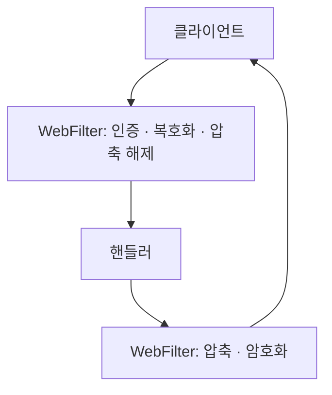

서비스 API 서버에서 요청·응답 body 를 공통 WebFilter 로 암복호화했는데, body 가 잘린 채 핸들러로 넘어갔다. Spring WebFlux 의 `getBody()` 는 `Flux<DataBuffer>` 인데, 조각 하나를 body 전체로 읽고 있었다.

예외가 나지 않아 짧은 payload 에서는 드러나지 않았다. 전체가 있어야 성립하는 연산을 스트림 위에 얹을 때 무엇부터 의심할지 적는다.

{: #situation data-k="SITUATION"}
## 어디서, 무엇을 하다가

신규 서비스의 API 서버다. Java 17, Spring Boot 3.2 위에서 WebFlux 로 짰다.

인증·암복호화·압축은 요청마다 되풀이되는 관심사라, 개별 API 가 아니라 WebFilter 한 자리로 올렸다. 공통 인증 연동과 RSA/AES 암복호화, Protobuf·gzip 압축이 여기 모여 있다.



*복호화가 핸들러보다 앞이라, filter 가 읽어 낸 바이트가 곧 핸들러가 보는 body 다 — filter 가 덜 읽으면 핸들러는 덜 받았다는 것조차 모른다.*

{: #symptom data-k="SYMPTOM"}
## 보이는 것

- body 가 중간에서 끊긴 채로 핸들러에 닿았다.
- 예외도 경고도 없었다. filter 는 정상 종료했다.
- payload 가 짧은 API 는 멀쩡히 돌았다. 요청 종류에 따라 되고 안 되고가 갈렸다.

로그가 없다는 것이 첫 단서였다. 이 세 관측만으로도 후보가 걸러진다.

| 관측 | 이 관측이 배제하는 것 |
|---|---|
| 예외도 경고도 없다 | 키·알고리즘 불일치 — 어긋났다면 복호화하는 그 자리에서 터진다 |
| 짧은 payload 는 정상 | filter 등록 순서·설정 오류 — 그랬다면 요청 종류와 상관없이 전부 깨진다 |
| 길이가 커지면 깨진다 | 특정 필드·문자 인코딩 — 값이 아니라 크기가 변수다 |

남는 자리는 하나다. 크기에 따라 갈리는데, 아무도 실패를 알리지 않는 곳.

{: #root-cause data-k="ROOT CAUSE"}
## 왜 에러가 안 났나

`ServerHttpRequest#getBody()` 의 반환형은 `Mono<DataBuffer>` 가 아니라 `Flux<DataBuffer>` 다. 조각이 여러 번 도착할 수 있다는 계약이 타입에 이미 적혀 있다.

거기서 첫 조각만 꺼내 쓰고 있었다. 조용했던 이유는 두 가지다.

- `Flux` 에서 원소 하나만 꺼내는 것은 정상 연산이다. 스트림이 아직 안 끝났다는 신호가 코드로 오지 않는다.
- 짧은 payload 는 조각 하나에 다 들어온다. 그때는 "한 조각 = body 전체" 가 우연히 참이다.

<figure class="fig">
<div class="fig-scroll">
<svg viewBox="0 0 620 170" role="img" aria-label="짧은 payload 는 조각 하나로 도착해 우연히 맞고, 긴 payload 는 조각 여럿으로 나뉘어 첫 조각만 읽힌다">
  <text class="d-band" x="8" y="16">① 짧은 payload — 조각이 하나</text>
  <rect class="d-box d-em" x="8" y="26" width="120" height="36" rx="2"/>
  <text class="d-t" x="68" y="43" text-anchor="middle">조각 1</text>
  <text class="d-t2" x="68" y="57" text-anchor="middle">읽음</text>
  <line class="d-l" x1="128" y1="44" x2="176" y2="44"/>
  <text class="d-lbl" x="186" y="41">읽은 것 = body 전체</text>
  <text class="d-lbl" x="186" y="57">우연히 맞는다</text>
  <text class="d-band" x="8" y="98">② 긴 payload — 조각이 여럿</text>
  <rect class="d-box d-em" x="8" y="108" width="120" height="36" rx="2"/>
  <text class="d-t" x="68" y="125" text-anchor="middle">조각 1</text>
  <text class="d-t2" x="68" y="139" text-anchor="middle">읽음</text>
  <rect class="d-box d-alt" x="134" y="108" width="120" height="36" rx="2"/>
  <text class="d-t" x="194" y="130" text-anchor="middle">조각 2</text>
  <rect class="d-box d-alt" x="260" y="108" width="120" height="36" rx="2"/>
  <text class="d-t" x="320" y="130" text-anchor="middle">조각 3</text>
  <line class="d-l d-dash" x1="380" y1="126" x2="420" y2="126"/>
  <text class="d-lbl d-em" x="428" y="123">읽은 것 = 조각 1</text>
  <text class="d-lbl" x="428" y="139">나머지는 버려진다</text>
</svg>
</div>
<figcaption>같은 코드가 짧은 요청에서는 맞는 답을 낸다 — 그래서 결함이 payload 길이 뒤에 숨는다.</figcaption>
</figure>

{: #fix data-k="FIX"}
## 바꾼 것

조각이 다 도착할 때까지 기다렸다가 하나로 합친 뒤 처리하도록 바꿨다. `DataBufferUtils.join` 이 그 일을 한다.

아래 두 조각은 실제 프로젝트 코드가 아니라, 공개 API 로 재구성한 최소 형태다.

```java
// 잘못된 쪽 — Flux 에서 첫 조각만 꺼내 body 전체로 쓴다
exchange.getRequest().getBody()
        .next()                          // Mono<DataBuffer>: 조각 하나
        .map(buf -> decrypt(toBytes(buf)));
```

```java
// 고친 쪽 — 완결을 명시적으로 기다린 뒤 합친다
DataBufferUtils.join(exchange.getRequest().getBody())
        .map(joined -> {
            byte[] bytes = new byte[joined.readableByteCount()];
            joined.read(bytes);
            DataBufferUtils.release(joined);
            return decrypt(bytes);
        });
```

합친 body 는 `ServerHttpRequestDecorator` 로 감싸 하류에 넘긴다. 원본 `Flux` 는 이미 소비돼서, 그냥 두면 핸들러가 빈 body 를 본다.

응답 쪽도 같다. `ServerHttpResponseDecorator#writeWith` 가 받는 것도 `Publisher<? extends DataBuffer>` 라서, 암호화하기 전에 한 번 합쳐야 한다.

감수한 것이 있다. `join` 은 body 전체를 메모리에 올린다. 대용량 업로드나 스트리밍 응답 경로에 이 filter 를 태우면 그만큼이 그대로 힙에 쌓인다.

{: #prevention data-k="PREVENTION"}
## 다시 안 겪으려면

| 넣은 것 | 무엇을 막나 | 아직 못 막는 것 |
|---|---|---|
| 서명·암복호화·파싱은 완결을 명시적으로 기다린 뒤에 한다는 규칙 | 부분 입력을 전체로 오인하는 것 | 규칙을 모르는 사람이 body 를 만지는 filter 를 새로 붙이는 경우 |
| 조각이 여러 개로 쪼개질 크기의 payload 를 테스트에 넣음 | 짧은 요청만 도는 테스트가 통과시키는 결함 | 분할 지점은 환경·버전마다 달라, 어떤 크기면 충분한지 보장하지 못한다 |
| body 를 다루는 filter 의 적용 경로를 한정 | 대용량 경로가 `join` 으로 메모리를 통째로 쓰는 것 | 경로 한정을 빠뜨린 채 추가되는 endpoint |

코드에서 볼 자리는 한 곳이다. **반환 타입이 `Flux` 인데 원소를 하나만 꺼내 쓰고 있으면 거기가 의심할 자리다.** body 를 다루는 코드에 `next()`, `take(1)`, `blockFirst()` 가 있으면 먼저 읽어 본다.

프레임 경계에서 남은 바이트를 다음 조각으로 넘기지 않아 스트리밍 응답이 잘린 일도 같은 계열이었다. 그건 다른 글에서 다룬다.
